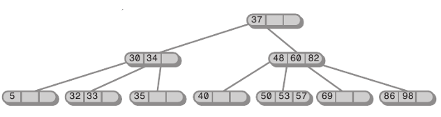

## 2-3-4 Tree
____________________________________________
- red-black 트리의 쌍둥이 트리라고 불리며 2-3-4 트리는 이진트리는 아니다   
- 노드의 자식으로 2개에서 4개까지 가질 수 있으며 개수에 따라서 2,3,4노드로 나뉜다     
  - 2-노드 -> 자식 개수 2개
  - 3-노드 -> 자식 개수 3개
  - 4-노드 -> 자식 개수 4개
- 모든 리프 노드는 마지막 레벨에 위치해야 한다.
- 리프 노드들은 원형 이중 연결 리스트에 의해 좌우로 연결되어 있다.    

**트리의 높이**
2-3-4 트리의 노드 개수가 정해져 있다면 
  - 최대 높이 : 노드가 모두 자식을 2개씩 가지는 경우 -> log2의 n
  - 최소 높이 : 노드가 모두 자식을 4개씩 가지는 경우 -> log4의 n   

=>2-3-4트리의 h = O(logn)   

**search 연산**    
위 사진의 예시를 보면 [48, 60, 82]노드가 네 개의 자식 노드를 가지고 있다.    
이 노드에서 3개의 key가 정렬된 상태로 저장되어 있다.    
첫 번째 자식노드에는 48보다 작은 값이, 두 번째 자식 노드에는 48이상 60미만의 값들이, 
세 번째 자식노드에는 60이상 82미만의 값들이, 네 번째 자식 노드에는 82이상의 값들이 저장되어 있다는 의미이다.   

어떤 key 값을 탐색 한다는 것은 루트 노드부터 해당 key 값이 속해 있을 자식 노드를 따라 내려가기만 하면 된다.   
한 노드에서 어떤 자식 노드를 선택해 내려가는 것은 상수 시간에 가능하므로 전체 탐색 시간은 O(h)시간이면 충분하다.   
h = O(logn)이므로 탐색은 O(logn) 시간 내에 가능하다

**insert 연산**

