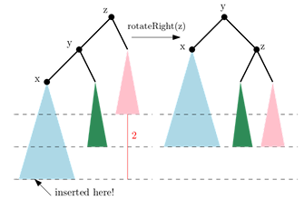
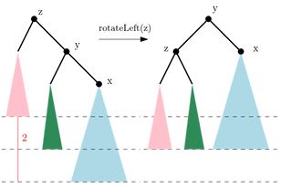
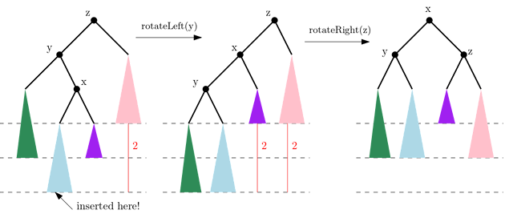
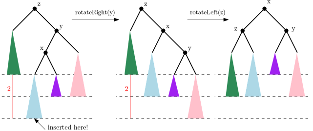
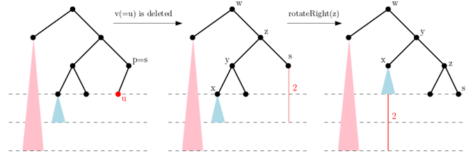
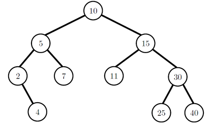
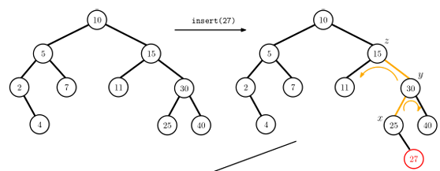
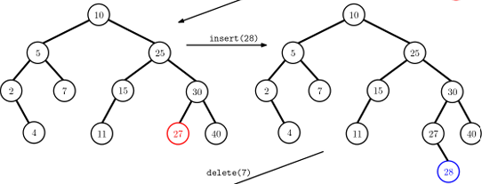
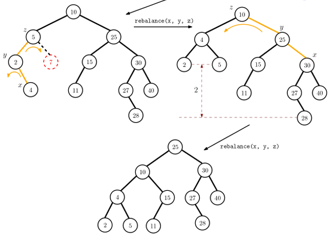

## AVL 트리
__________________________________________
모든 노드에 대해서, 노드의 왼쪽 부트리와 오른쪽 부트리의 높이 차이가 1 이하인 이진 탐색 트리

**양쪽 부트리의 높이 차가 1 이하면 h = O(logn)을 보장하는 증명은 교재 참고**  

### rebalancing
삽입과 삭제를 하게 되면, 어떤 노드의 두 서브트리의 높이 차가 1보다 크게 되는 경우가 발생.   
-> 특별한 규칙에 따라 한 번 또는 여러 번의 회전 회전을 통해 조건이 만족되도록 트리의 높이를 재조정(rebalancing).

**rebalance에도 종류**
1. left-left  

2. right-right (left-left와 대칭)  
 
3. left-right  

4. right-left  (left-right와 대칭)  

**rebalance(x, y, z) 구현**
1. z - y - x 순서로  부모-자식 관계라고 가정한다.   
위에서 보여준 4가지 종류를 대칭을 제외하면 두 가지 경우로 나눠 처리한다.
    - z - y - x가 일직선인 경우 -> 한번의 회전이면 충분.
    - z - y - x가 삼각형 모양인 경우 -> 두번의 회전 필요.

2. rebalancing 한 후에 z 노드 위치의 노드 (top 노드)를 리턴하도록 구현해야한다.   
   (경우에 따라 트리의 루트가 바뀔 수 있어서 이 경우에 self.root를 update해야함.)

<pre>
<code>
def rebalance(x, y, z):
    if z == None:        #rebalance 불필요
        return
    if z.left == y and y.left == x:      #왼쪽 방향 일직선
        self.rotateRight(z)
        return y
    elif z.right == y and y.right == x:  #오른쪽 방향 일직선
        self.rotateLeft(z)
        return y
    elif z.left == y and y.right == x:   #삼각형 경우 1
        self.rotateLeft(y)
        self.rotateRight(z)
        return x
    elif z.right == y and y.left == x:   #삼각형 경우 2
        self.rotateRight(y)
        self.rotateLeft(z)
        return x
</code>
</pre>

### 삽입 : insert(key)
1. 삽입 연산 자체는 BST클래스의 insert 함수를 사용한다.    
   BST의 insert함수는 key값을 갖는 새로운 노드 v를 만들어 삽입한 후, v를 리턴한다.   
   - 부모(조상) 클래스의 같은 이름의 메소드를 호출하는 법:    
        v = super(AVL,self).insert(key)   
        #super(현재 클래스 이름, self).method() 형식
2. v로 인해 조상 노드의 균형이 깨질 수 있음 -> **rebalncing** 필요!    
    -> rotation을 통해 높이 조정.

3. v에서 루트로 올라가면서 균형이 처음 깨진 노드를 z라 하자
    - z -> v 경로에서 z의 자식노드를 y, y의 자식노드를 x라 하자(x == v일 수도 있음)   
    - 균형을 맞추는 함수 rebalnce(x, y, z)를 호출해 균형을 맞춤.

**Pseudo 코드**
<pre>
<code>
def insert(self, key):
    # BST의 insert 함수는 실제 삽입된 노드가 리턴됨
    1. v = super(AVL, self).insert(key)
    
    2. find x, y, z    # 조상 노드를 따라 올라가면서 찾기
        x, y, z = v, v.parent, None
        while y :
            z = y.parent
            if z and z is balanced:
                x, y = y, z
            else :
                break
    3. w = rebalance(x, y ,z)
    4. if w.parent == None:     #root가 바뀐 경우
        self.root = w
</code>
</pre>

### 삭제 : delete(u)
-> 삭제할 key 값이 저장된 노드 u를 매개변수로 전달

1. u를 BST의 삭제 방법 중 하나(merging 또는 copying)를 이용해 삭제한다.   
   merging과 copying은 실제 u가 삭제되거나 다른 노드로 대체되는데 그 과정에서 높이에 영향을 받을 수 있는    
   첫 노드를 s로 리턴한다.
2. deleteByMerging을 사용한다면, 리턴 노드 s부터 위로 올라가면서 높이 조건이 만족하지 않는(균형이 깨지는) 첫 노드 z를 찾는다.   
3. deleteByCopying을 사용한다면, Merging방법과 유사하게 높이에 영향을 받을 수 있는 가장 깊은 곳의 노드 z를 정하면 된다.   
4.   
   - z에서 균형을 맞추기 위해서는 z의 부트리 중에서 높이가 더 큰(무거운) 부트리에 속하는 z의 자식 노드를 y로 정한다.    
   같은 방식으로 y의 부트리 중에서 높이가 더 큰 부트리에 속하는 y의 자식 노드를 x로 한다.    
   -> insert 함수의 경우와 같이 z - y - x 세 노드가 정의된다.   
   - 이 z - y - x를 찾는 부분이 insert와 다른 부분이다.   
    -> insert는 새로운 노드 v가 삽입되는 곳이 무거워져 높이 균형이 깨지게 되지만   
    delete에서는 노드 u가 삭제되면서 가벼워져 높이 균형이 깨지게 되기에 다를 수 밖에 없음.   
   - 이렇게 x, y, z를 정의하는 이유는 회전을 통해 무거운 쪽의 일부를 가벼운 쪽으로 넘겨 높이 차를 줄이기 위해.
    
**아래 그림 상황을 예로 설명**   

- 가장 왼쪽 그림처럼 리프노드인 u가 삭제되면, z 노드에서 불균형이 발생할 수 있다.
- 이를 조정하기 위해선 z의 왼쪽 자식 노드를 y, y의 자식중 더 무거운 쪽 자식 노드를 x   
  그 뒤 z에서 rotateRight(z)를 해야한다.(회전한 결과가 오른쪽 그림)  
- 회전을 통해 z-y-x의 균형은 맞췄지만, y의 새로운 부모 노드인 w에서 균형이 깨지게 된다.    
  (이런 현상은 insert에선 일어나지 않음)
- 따라서 다시 w->z, y->y, x->x로 지정하여 균형을 다시 맞춰야 한다.   
  (경우에 따라서 루트 노드까지 이 작업 반복)
- 루트까지 올라가면서 균형을 맞추는 과정은 트리의 높이 만큼만 반복하면 된다.   
  -> O(h) = O(logn) 회전이면 충분. -> O(logn) 시간.

**Pseudo 코드**   
<pre>
<code>
def delete(self, u):
    # deleteByMerging, Copying둘다 사용가능
    # 노드의 삭제로 노드 높이에 영향을 받는 (불균형 가능성 있는)
    # 첫 노드 s가 리턴된다 가정!
    
    s = super(AVL, self).deleteByCopying(u)
    
    while s != None:       # go up to root
        update s.height properly
        if s is not balanced:       # z - y - x chain 존재
            z = s
            # z.left, z.right가 None인 경우에 height - 1 로 가정
            if z.left.height >= z.right.height:
                y = z.left
            else : 
                y = z.right
            if y.left.height >= y.right.height :
                x = y.left
            else:
                x = y.right
            s = rebalance(x, y, z)
            # rebalance는 rotation 후 새로운 top 노드를 리턴
        w = s
        s = s.parent
    self.root = w       # w가 새로운 루트 노드가 될 수 있음
</code>
</pre>

### 연산 수행 시간
1. search: 트리 높이 h가 O(logn)이므로 O(logn) 시간에 가능
2. insert: 삽입될 위치 탐색에 O(logn),    
   재조정을 위한 회전을 상수번 실행 한다고 증명되어 총 O(logn)시간에 가능
3. delete: 삭제할 노드 탐색에 O(logn)시간, 삭제 후 재조정을 위한   
   회전을 최악의 경우에 O(logn)번 실행할 수도 있다고 증명되어총 O(logn) 시간에 가능

### 연습
아래 AVL 트리에 insert(27)를 수행 해본다. 다음으로 insert(28), delete(search(7))도 수행.

