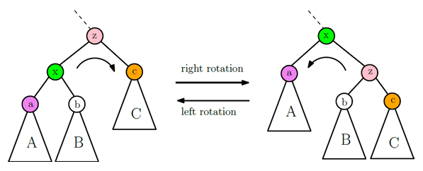

## Balanced Binary Search Tree  
## (균형 이진 탐색 트리/BBST)
____________________________________________________
이진 탐색 트리 연산은 오직 트리 높이 h에 의해 결정된다.   
최악의 경우에는 h = O(n)이 되어 탐색, 삽입, 삭제 시간이 매우 오래 걸림.   
-> 연산 속도를 빠르게 하기 위해선 트리 높이를 작게 유지해야 함.   

삽입, 삭제 연산을 반복하더라도 n개의 노드를 갖는    
이진트리의 높이를 항상 O(logn)으로 유지하는 트리를 **균형 이진 탐색 트리**라고 한다.   

균형 이진 탐색 트리에는 AVL 트리, RED-Black 트리, 2-3-4 트리, Splay 트리 등이 있다.

### rotation 연산
삽입과 삭제로 인해 h = O(logn)이라는 조건을 유지할 수 있도록 필요한 경우에   
이진트리의 모양을 변경해서 높이를 줄이는 연산.

- left rotation과 right rotation이 있고, 서로 대칭적
- 회전 후에도 BST값의 순서가 그대로 유지 되어야 한다.
- 아래 그림에서, right rotation 전의 inorder 순서는 AxBZc이고,  
회전 후의 순서 역시 AxBZc이므로 같다.  left rotation 전,후도 동일
- 수행시간 : 상수 개의 링크 수정이면 충분하므로 **연산은 O(1)의 시간**

### 코드
<pre>
<code>
def rotationRight(self, z):     #rotationleft도 유사하게 정의
    if z == None: return        # z가 None일 때 do nothing
    x = z.left
    if x == None : return       # x가 None일 때 no rotate 
    b = x.right                 # b가 None인 경우는 가능
    x.parent = z.parent
    if z.parent:
        if z.parent.left == z:
            z.parent.left = x
        else :  
            z.parent.right = x
    x.right = z
    z.parent = x
    z.left = b
    if b : 
        b.parent = z
    
    # z가 루트였다면 x가 새로운 루트가 되어야함.
    if z == self.root :
        self.root = x
    
    # height를 관리한다면 z와 x의 height 수정하는 코드 추가해야함.
    self.update_node_height(z)
    self.update_node_height(x)
    
</code>
</pre>

#### 균형 이진 탐색 트리의 AVL, Red-Black트리 등은 현 폴더에 새롭게 폴더를 만들었음.