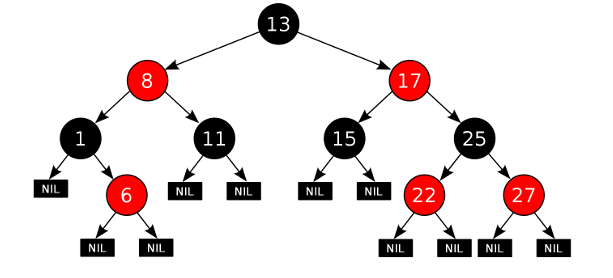
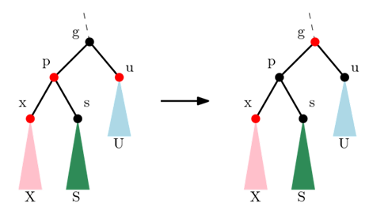
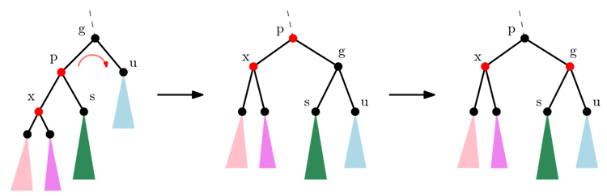
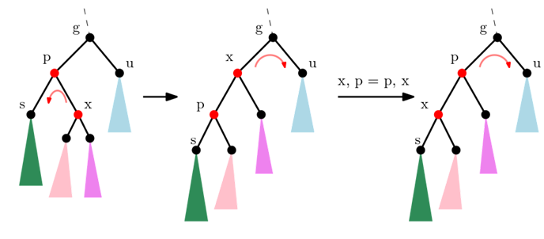
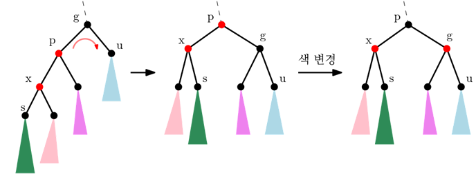
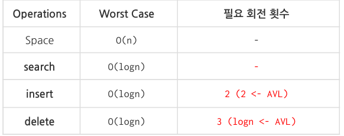

## Red-Black Tree
_________________________________
**가정**  
1. 리프노드의 두 자식 노드인 None노드는 NIL 노드라고 부른다. (None 노드라해도 상관없음)   
2. Red-Black 트리를 정의하는 동안 NIL 노드를  리프노드 또는 외부노드라고 부름
3. NIL노드가 아닌 일반 노드를 내부 노드라고 부름

**정의**- 다음의 5가지 조건을 만족해야 한다
1. 각 노드는 red 또는 black의 색을 갖는다
2. 루트노드의 색은 black 이다.
3. NIL 노드의 색은 black 이다. -> 루트 노드의 부모 노드도 NIL이므로 black이다.
4. 어떤 노드가 red라면, 두 자식 노드는 모두 black 이다.
5. 어떤 노드에서 서브트리의 리프 NIL 노드까지의 모든 경로에 포함된 black노드의 개수는 같다(이를 black-height라고 칭함)

**Red-Black 트리 예시**    
    
-> 루트 노드와 모든 NIL노드는 black, red 노드의 두 자식 노드는 모두 black    
-> 임의의 노드에서 서브트리의 각 NIL 노드까지의 경로에 포함된 black노드의 개수는 3으로 같음   

**Red-Black 높이 구하기**    
답 : **O(logn)**   

**증명**    
1. h(v) : v의 높이 (또는 v의 서브트리 높이)
2. bh(v) : v에서 v의 서브트리의 NIL 노드까지의 경로에 포함된 black 노드 개수(black-height)    
   (v가 black이라면 v는 bh의 개수에 포함되지 않는다)
3. 사실 1 : 노드 v의 서브트리가 가질 수 있는 내부 노드의 최소 개수는 2**(bh(v)) - 1 이다.
    - h(v)에 관한 귀납법(induction)에 의해 증명
    - h(v) = 0인 기본 경우(base case)에 성립함을 증명한 후, h(v) <= k인 경우 성립한다고 가정(inductive hypothesis)을    
      한 후 h(v) = k + 1 인 경우 성립함을 증명하는 방식
    - h(v) = 0 인 경우 : 내부 노드가 없으므로 NIL하나로 구성된 빈 트리가 되어, bh(v) = 0이 되어야함.
      - 2**(bh(v))- 1 = 2**0 - 1 = 0
    - h(v) <= k 인 경우에는 v의 자손 내부 노드의 최소 개수 >= 2**bh(v) - 1 가정
    - h(v) = k + 1 인 경우:
        - h(v) > 0 이 성립함
        - v의 두 자식노드의 black height는 bh(v)이거나 bh(v-1) 중 하나이다.
        - v의 두 자식노드의 높이는 당연히 v의 높이보다 작다 -> 따라서 두 자식 노드에 대해서 가정이 성립
        - 그럼 v의 두 자식 서브트리에 포함된 내부 노드 개수에 대한 최소 개수는
            -2**(bh(v)-1) - 1 + 2**(bh(v)-1) - 1 + 1 = 2**b(h) -1 로 증명완료
4. 사실 2 : 루트에서 NIL까지의 임의의 경로에 포함된 black 노드 수는 경로에 포함된 노드 수의 반 이상이다.   
    -> black 노드 수 >= h/2
5. 사실 2로부터 루트 노드 r의 black height bh(r)은 bh(r) >= h(r)/2
6. 사실 1에의해 트리 노드 수는 최소 2**(bh(r)) - 1 >= 2**(h(r)/2) - 1 이상이어야 함.
7. n >= 2**h(r)/2 - 1   ->  h(r) <= 2log(n+1) 이므로 트리의 높이는 **O(logn)** 이다.

**insertion 전략**   
insert에 대한 직접적인 설명은 아니지만 전략에 대해 이야기 하겠음.    

1. 새 노드 x를 BST의 insert연산을 호출해 삽입한다
2. x의 색을 우선 red로 칠한다 (x.color = red)
3. x.parent.color == black이 될 때까지 위로 올라가면서 아래처럼 경우를 나눠 색 배정 과정을 반복한다    
<pre>
<code>
while x.parent.color == red :       # x가 루트라면, x.parent는 NIL노드
                                    # NIL 노드 색은 정의에 의해 black
#p, g, s, u정의
   p = x.parent
   g = x.parent.parent
   s = x.sibling
   u = x.uncle

</code>
</pre>

p.color == red 이므로 조건 4가 깨짐 -> 색 조정필요    
여기서 s.color는 항상 black이다 이유는 x.parent가 red이기 때문에 그 자식은 black    

경우 1 : u.color == red 인 상황
- x의 부모를 red, 부모와 엉클은 블랙으로 색 조정을 한다
- g.color = red
- p.color = u.color = black
- g의 부모노드가 red일 수 있다. 이런 경우 다시 색 조정
    - x = g로 하여 while 루프를 반복!    
    - 만약 g가 루트노드라면, g.parent가 NIL노드, 즉 black노드 이므로 루프를 탈출함에 주의하자
    -g.color가 red인 채로 루프를 탈출하기 때문에, 조건 2번을 만족하기 위해서는 루트노드의 색을 무조건 black으로 지정해야한다 ->  
    가장 마지막에 T.root.color = black을 실행    

경우 2 : u.color == black    
- 경우 2.1 : x - p - g가 linear 모양(일직선)인 경우
    - 노드 g에서 한 번 회전
    - p.color = black, g.color = red
    - p가 black이 되므로 p의 부모노드의 색을 신경쓸 필요 없음 -> 더이상 색 조정 x  
    - while루프의 조건문에서 x.parent.color = p.color = black이 되어 루프를 탈출 -> 재조정 작업 끝
    - 한 번의 회전만으로 색 조정    
    
- 경우 2.2 : x - p - g가 triangle 모양인 경우
    - 노드 p에서 한 번 회전 후  x, p = p, x (즉, x와 p의 역할을 바꿈) -> x - p - g가 선형
    - 노드 g에서 한 번 더 회전(두번째 회전)
    - p.color = black, g.color = red
    - p.color = black이 되어 색 조정 완료 -> while문 탈출
    - 두 번의 색 조정으로 색 조정 완료   
   
      

**delete**    
교재 및 강의에서는 복잡하여 생략되었음. 직접 해보는 경험을 가지라 하심.

**수행시간 및 필요 회전 횟수 정리**
   
- AVL트리와의 차이점은 delete 연산에 필요한 회전 횟수가 3번으로 매우 작다는 점이다.

