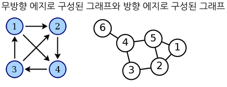
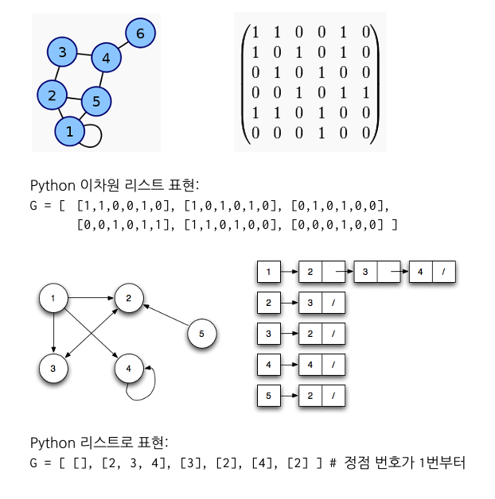
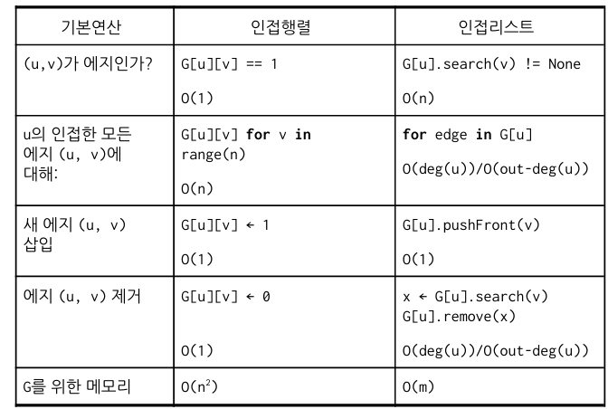

## Graph 기초
____________________
#### Graph란?   
두 노드 사이의 관계가 있는 경우 에지(링크)로 연결하여 표현하는 추상적이고 일반적인 자료구조.  
- 트리 - 사이클이 없는 그래프
- 연결리스트 - 하나의 경로로 이루어진 트리(가장 단순한 형태의 그래프)

#### 기본 용어 정리   
- 그래프 G = (V,E)
    - V = 노드(node)또는 정점(vertex) 집합을 의미.
    - E = 두 노드의 쌍으로 정의. 만약 (u,v) ∈ E 라면 노드u와 노드v가 서로 (방향 없는)에지로 연결되어 있다고 한다.
- 정점(vertex),노드(node)
- 에지(edge),링크(link)- 방향/무방향(directed/undirected edge)
- 무방향, 방향 그래프   
   
- 분지수(degree)
  - in-degree in-deg(u): 노드 u로 들어오는 방향 에지의 개수
  - out-degree out-deg(u): 노드 u에서 나가는 방향 에지의 개수
  - degree of vertex deg(u): 노드 u에 연결된 무방향 에지의 개수
  - degree of graph deg(G): 무방향 그래프 G의 최대 노드 분지수
- 인접성(adjacency,incidence)
  - 에지 (u,v)가 존재하면, u와 v는 서로 인접(adjacent)하다고 말함
  - 에지 e = (u,v)에 대해, e는 u와 v에 인접(incident)하다고 말함
- 경로(path)
  - 한 노드에서 다른 노드로 연결되는 선형경로로 경로에 포함된 노드는 모두 달라야 한다.  
    (방향 그래프에서의 경로는 한 방향 - 일방 통행 경로를 의미)  
    3 -> 2 -> 1 -> 5 (O)  
    3 -> 2 -> 1 -> 2-> 5-> (X)  - 중복
  - 경로의 길이는 에지에 가중치 값이 없는 경우는 경로의 에지 개수로 정의되고,   
    가중치 값이 있는 경우는 에지의 가중치 합으로 정의된다.
- 에지/정점 가중치(edge/vertex weight)
  - 가중치는 주로 비용(cost)의 역할을 한다.   
    -> 그래프의 두 노드를 연결하는 경로의 길이는 경로에 포함된 가중치의 합으로 정의.   
    -> 최단 경로는 경로의 길이가 가장 짧은 경로로 정의
- 사이클(cycle)
  - 출발 노드와 도착 노드가 동일한 경우로 정의함 -> 한 노드에서 출발해 해당 노드로 도착하는 원형 경로
- 트리(tree) : 사이클이 없는 연결 그래프
- 부그래프(subgraph)
  - 그래프의 정점 집합의 부분 집합과 그 부분 집합에 속하는 정점 사이에 정의된 에지 집합으로 정의되는 부분 그래프.   
  - 그래프가 트리인 경우 부트리(subtree)라고도 부름.
  - 집합(set)과 부분집합(subset)의 관계와 유사.
- 연결성(connectedness)
  - 두 노드가 연결(connected)되어 있다는 것 -> 두 노드를 연결하는 경로 존재
  - 그래프가 연결되어 있다는 것 -> 그래프의 모든 노드 쌍이 연결되어 있다는 것.
  - 그래프의 연결 성분은 그래프의 연결된 부그래프를 의미 -> 그래프는 한 개 이상의 연결 성분으로 구성된다
- 신장 그래프(spanning subgraph)
  - 부 그래프 중에서 그래프의 모든 노드가 등장하는 부그래프 의미.

#### 그래프 표현 방법 - 인접행렬/ 인접리스트
그래프의 표현 방법은 아래 두 가지로 표현 가능하다.
1. 인접행렬(adjacency matrix) - 인접성을 행렬(2차원 배열/리스트)로 표현  
2. 인접리스트(adjacency list) - 정점에 인접한 에지만을 연결리스트로 표현

#### 표현법에 따른 기본 연산 시간 비교
n = |V| = 노드 개수, m = |E| = 에지 개수  
Python 리스트에 저장한다고 가정

#### 정리
그래프를 표현하는 방법에는 인접행렬, 인접리스트가 있으며 각각은 장 단점이 달라 필요에 따라 사용하면 된다.
인접행렬은 메모리는 O(n**2)으로 공간은 많이 차지하지만 기본 연산들이 대부분 O(1)으로 빠르며   
인접리스트는 메모리는 O(n+m)으로 공간은 비교적 많이 차지 안하지만 기본 연산들이 인접행렬보다 느리다.
