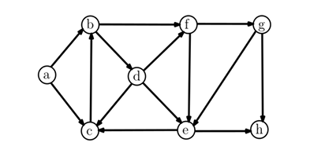
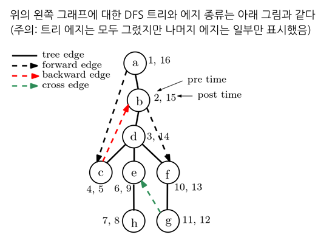
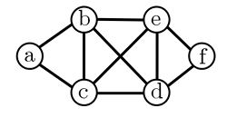

## DFS(Depth First Search) : 깊이 우선 탐색
_____________________________________________
#### 지금까지 배운 순회   
지금까지 배운 순회는 트리에서 주로 쓰는 순회였다.   
- preorder 
- inorder
- postorder

#### DFS(Depth First Search: 깊이 우선 방문)
DFS는 현재 방문한 노드에서 방문하지 않은 이웃 노드가 있다면 방문하는 방식으로, 두가지 방법이 있다.   
1. 재귀적인 방식
<pre>
<code>
RecursiveDFS(v): # v는 현재 방문중인 노드
    mark[v] = "visited"        
    pre[v] = cur_time    #pre[v] = v의 첫번째 방문시간 / post[v] = v의 마지막 방문(완료)시간
    cur_time += 1        #cur_time의 시작은 1
    for each edge(v,w): #에지 순서는 임의로(예를 들어 알파벳 순서),v의 인접한 모든 노드 w에 대해
        if w is unmarked:   #인접한 노드 w가 미 방문이면
            parent[w] = v
            RecursiveDFS(w)
    # v에 인접한 모든 노드를 고려완료
    post[v] = cur_time      #v에서 DFS완료시간
    cur_time += 1
</code>
</pre>
2. 비재귀적인(반복) 방식
<pre>
<code>
IterativeDFS(s):
    stack.push(s):  #나중에 방문할 노드를 스택에 대기시킴
    while stack is not empty:
        v ← stack.pop()
        if v is unmarked:
            mark v as visited node
            for each edge(v,w):
                if w is unmarked:
                    stack.push(w)
</code>
</pre>

#### 수행시간
각 노드 v를 방문할 때, v에 인접한 미방문 노드 w가 스택에 push되고 적당한 때에 다시 pop된다.   
즉, 에지 (v,w)에 대해 한 번의 push와 한 번의 pop이 이루어진다고 해석된다.   
따라서 push,pop은 O(1)이 걸리므로 O(m)시간이면 충분하다.    
추가로 노드 개수만큼 시간이 증가하므로 O(n+m)이 된다.

  
#### 새로운 상황 - 그래프가 안 이어져 있는경우(DFS ALL)
만약 a,b,c노드와 d,e노드가 각각 서로만 이어져 있고 따로 떨어져 있지만   
하나의 그래프로 본다고 할 때 DFS를 어떻게 할 것인가?   

<pre>
<code>
DFS_ALLL(G):       #G를 DFS search
    for all node v in G:
        mark[v] = "unvisited"
    for all nodes v:
        if mark[v] != "visited" : DFS(v)
</code>
</pre>

#### DFS 트리
  
DFS 시작 노드가 루트 노드가 되며, 방문을 하면서 정의되는 부모-자식 노드 관계에 의해 정의되는 트리이다.   

또 신장 트리(spanning tree/ 무방향 그래프에서 모든 노드를 포함하는 부분 그래프이며, 사이클이 없는 단순 연결 그래프(Tree))이다.   

DFS 트리의 나타난 에지(u,v)를 네 개의 타입으로 구별
- tree-edge : DFS를 구성하는 에지
- forward-edge : 트리 에지가 아닌 조상 → 자손으로 향하는 에지
- backward-edge : 트리 에지가 아닌 자손 → 조상으로 향하는 에지 
- cross-edge : DFS트리, forward,backward도 아닌 그래프의 에지    
  
- 무방향 그래프에서는 backward 에지와 forward 에지는 구별하지 않는다
- 무방향/방향 그래프의 사이클(cycle)이 있는 지 검사하고 싶을 때에는 backward 에지가 존재하는지만 검사하면된다    
-> backward에지는 자손노드에서 조상노드로 향하는 에지이다.그런데 조상노드에서 자손노드까지는 트리에지로    
연결된 경로가 존재한다. 결국 조상노드와 자손노드를 연결하는 사이클이 존재한다는 의미.

#### BFS(Breadth First Search : 너비 우선 방문)
현재 방문 노드에서 방문하지 않은 이웃 노드를 차례대로 방문하는 방식   
    
위의 예: 노드 a 부터 출발한다면, ,a → {b, c} → {e, d} → e 순으로 출발   
노드부터의 거리 순으로 노드들을 방문하게 된다. 즉, 출발 노드로부터 거리가 1인(에지 하나로 갈 수 있는 노드)들을   
모두 방문하고, 거리가 2인 노드를(거리가 1인 노드들의 이웃 노드들) 모두 방문하는 방식   

**큐(Queue)사용**    
큐(queue) Q = {a}를 준비하여,v = Q.dequeue()하여 노드 v를 방문하고,   
v의 인접한 미방문 노드 w를 모두 Q.enqueue(w)하는 단계를 반복하면 된다.  

리스트 dist[v]는 출발 노드로부터 거리(출발 노드와 v를 잇는 경로의 에지 개수)가 저장된다.
<pre>
<code>
BFS(G):
    visited = [False] * n #BFS 중간에 방문했는지 기록
    parent = [-1] * n      #BFS 트리에서의 parent 기록
    dist = [0] * n          #source 노드로부터의 최단거리 기록

    for all source nodes s in G:
        Q.enqueue(s)
        visited[s] = True
        while Q is not empty:
            v = Q.dequeue()
            for each edge v → w :
                if not visited[w]:
                    Q.enqueue(w)
                    visited[w] = True
                    parent[w] = v
                    dist[w] = dist[v] + 1
</code>
</pre>

**수행시간**   
DFS와 유사하게 각 에지(v, w)에대해, w가 한 번씩 enqueue, dequeue되기에 O(n + m) 시간이면 충분
