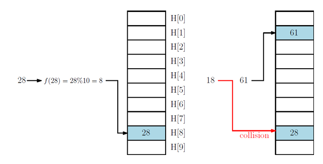
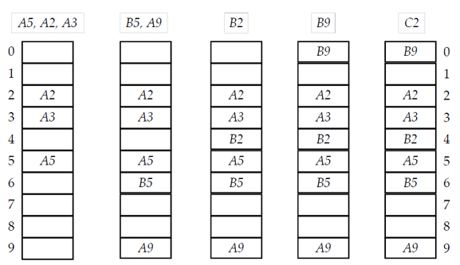
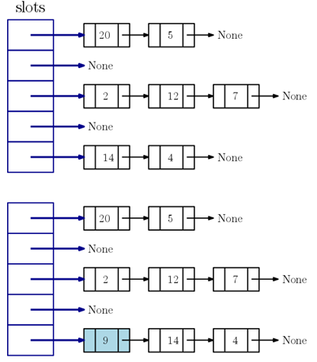

## Hash Table
_____________________
1. 해쉬 테이블은 일종의 사전(dictionary), Python의 dict 자료구조처럼 
연산을 빠르게 지원한다.
2. 파이썬의 dict 자료구조도 실제 해시테이블로 구현되어 있음.
3. 해시 테이블은 보통 정보를 담아 저장할 수 있는 서랍장(테이블)형태로 구현.
    1. 예를 들어, 정보 A는 3번째 서랍에 저장하기로 정하고, B는 0번째에, C는 다시
        3번째에 ,D는 4번째에 저장하는 식이다.  
        예를 들어,양말과 장갑은 두번째 서랍에, 수건과 마스크는 4번째 서랍에 넣는 식이다.
    2. 만약 수건을 찾고 싶다면, 수건이 저장된 서랍 번호를 먼저 알아낸 후, 네번째
        서랍에 들어 있는 아이템들을 하나씩 비교해 원하는 수건을 찾아내면 된다.
    3. 가장 핵심적인 내용 중 하나는 주어진 정보를 몇 번째 서랍에 넣을지 결정하는 것이다.    

4. 정보 K(key 값)가 저장될 서랍장(슬롯, slot)번호를 계산하는 함수 f()를 해시 함수(hash function)라고 한다.
    1. 예를 들어, 해시 테이블 H를 일차원 배열 또는 리스트 H[10]으로 선언해 사용한다고 하자.
    2. 해시 함수는 f(K) = K % 10 로 정의해보자.
    3. K = 28을 저장하고 싶다면, H[f(28)]슬롯에 저장된다. 즉 H[8]에 저장된다.
    4. K = 61을 저장은 H[f(61)] = H[1]에 저장된다.
    5. K = 18도 H[f(18)] = H[8]에 저장되어야 한다. 그런데 이미 H[8]에는 28이 저장되어
        있다. 이 경우를 충돌(collision)이 발생했다고 한다.
    6. 충돌이 발생한 경우에, 18을 저장할 곳이 더 있으면 저장하면 되지만, 
    지금 예처럼 H[8]에 값 하나만 저장할 수 있는 경우엔 18을 다른 곳에 저장해야 한다.  다른 곳을
        정하는 방법을 충돌해결방법(collision resolution method)이라 부른다. 

**밑 그림 참고**
     

#### 해시 함수(Hash function)
1. key값이 정수가 아니고 실수 or 문자열 이라면?
    1. (실수,문자열)key 값을 정수에 대응시키는 prehash 함수를 먼저 사용해 변환.
    2. 파이썬의 hash(x) 함수는 x를 정수로 매핑하는 **prehash**함수(보통 prehash용으로만 사용함) 
        -> \_\_hash__ 특수 메서드로 지정해서 원하는 prehash 함수를 정의해 사용 가능

2. **완전(prefect)해시 함수** : 충돌 없이 1-to-1 매핑하는 해시 함수 
    ->이상적인 해시함수 -> 비현실적, 비효율적   
      

3. **c-universal 해시 함수** 
- 해시 함수 집합에서 임의로 해시 함수 f를 선택해, 서로 다른 임의의 두 key값 x,y에 대해   
  prob(f(x)==f(y)) = c/size(H)이 성립한다면, 해당 해시 함수를 c-universal이라 부른다. 
  (c는 1보다 크거나 같은 실수 상수)
- 즉, 서로 다른 두 key 값의 해시 함수 값이 같을 확률(충돌 발생 확률)이 해시 테이블의 크기에 반 비례하는 해시함수. 
    -> 비교적 골고루 매핑하고 완전해시 함수보다 계산하기 쉬워 현실적

4. 현실에서 자주 쓰이는 해시 함수들(1)
- Division : f(k) = (k mod p) mod m (p : 소수)  
    ->매우 간단한 해시 함수로 key값들의 성질이 잘 알려져 있지 않은 경우 유용.

- Multiplication : f(k) =  ((ak) mod 2**w) >> (w-r)  
    -> a: 랜덤값 , w = log k , r = log m

- Folding : key 값의 자리 값들을 나눠서 연산하는 형식
    1. shift folding의 예 :  
        k = 1254-387-601 → 두 digit씩 나눠 모두 더한 후 mod m→  (12 +
            54 + 38 + 76 + 01) mod m
    2. boundary folding의 예 : 
        여러 digit로 나눈 후, 더하는 데, 짝수번 조각은 거꾸로 해서 더함, 예:(12 +
    45 + 38 + 67 + 01)mod m 

- Mid-Square : key 값을 적당히 연산한 후, 그 결과의 중간 부분을 떼어내 함수 값으로 리턴 
        예: m = 1000, k = 3121 이라면, 3121**2 = 9740641이 되고 중간에 세 개의 digit를
        떼어낸 406이 리턴됨.

- Extraction: key 값의 각 파트마다 임의의 digit을 떼어내 연결해 계산 
    예: 계좌번호가 1254-387-601라면,1254에서 12, 601에서 1을 떼어낸 후 서로 붙여 121을 만듬.

5. 현실에서 자주 쓰이는 해시 함수들(2) : key 값이 str 일 때 

- Additive hash : k[i]의 단순 합 

- Rotating hash : <<. >> (비트 쉬프트)연산과 ^(exclusive or)연산을 반복 

- Universal hash : C++의 STL이나 Java에서 실제 사용되는 해시 함수
    1.  Bernstein hash: initial_value = 5381, a = 33
    2.  STLPort 4.6.2 hash: initial_value = 0, a = 5
    3.  java.lang.String.hashCode( ): initial_value = 0, a = 31

6. **좋은 해시 함수란?**
- fast computation -> 되도록 빠르게 계산되어야 한다.(함수 계산이 느리면 배보다 배꼽이 큰 꼴) 

- less collision -> 되도록 충돌이 적어야 한다.(충돌이 없을 수는 없지만, 가능한 적어야 함.) 
   -> 보통 c-universal 해시 함수를 사용한다. U-hash가 대표적인 예

- 빠른 연산을 중점에 두면 -> 충돌과다   
  충돌 저하에 중점을 두면 -> 느린연산   
  -> trade off 관계
-----------------
#### 충돌 해결 방법(collision resolution methods)

- 서로 다른 key 값 x, y값에 대해, f(x) = f(y)가 된다면 두 값은 충돌했다고 정의한다. 

- 이 경우엔 두 값을 해쉬 테이블에 저장할 수 있는 방법 - 충돌 해결 방법이 필요하다.  

- 충돌 해결 방법은 **Open addressing**과 **Chaining** 이 두가지 방법이 일반적이다.
    1. Open addressing은 충돌이 발생한 key값을 다른 빈 슬롯을 찾아 그 슬롯에 저장하는 방법을 말한다. 
        빈 슬롯을 찾는 규칙에 따라 **linear probing**,**quadratic probing**,**double hashing**등의 방법으로 세분화 한다.
    2. Chaining은 충돌이 발생하면 해당 슬롯에 연결된 연결 리스트에 pushFront 연산을 통해 삽입하는 식으로 해결한다.   
        즉, 해시 테이블의 슬롯마다 하나의 연결 리스트가 달려 있기 때문에 다른 빈 슬롯을 찾을 필요 없다.
    3. Open addressing은 슬롯에 하나의 key값만 저장되는 방식이고 Chaining은 슬롯에 여러 개의 key값이   
        연결리스트의 노드에 차례대로 저장되어 연결되어 있는 방식이다.
    4. Open addressing의 linear probing 방법이 가장 단순하고 이해하기 쉽다. 이 방법을 자세히 설명하고 나머지 방법은 간단히 정리하겠다.

### Open addressing : linear probing

1. 해시 테이블의 H의 slot에 값 하나만 저장할 수 있다고 가정.

2. 위 그림에서는 key 값 A5, A2, A3가 저장되고, 다음으로 B5, A9, B2, B9가 입력된다. 
(각 값이 저장되는 슬롯의 번호는 알파벳 다음 숫자라고 가정.)

3. A2, A3, A5가 저장된 후, B5가 저장될 차례라고 하자. B5는 5번째 슬롯에 저장되어야 하는데, 
   이미 A5가 저장되어 있다. 결국 다른 곳에 저장해야 함.

4. **linear probing 방법**은 아래 쪽으로 슬롯을 차례로 탐색하면서 가장 먼저 발견된 빈 슬롯에 저장하는 것이다. 
   선형적으로 다음 슬롯을 연속해서 검사하는 방법이기에 linear probing이라는 명칭이 붙음.

5. 이에 따라 B5는 H[6]에 저장된다.

6. 다음의 B[2]에 대해서는 H[2]에 저장되어야 하나 이미 다른 값이 있으니 H[3]가 비었는지 점검한다. 
   다른 값이 있으니 H[4]가 비었는지 본다. H[4]가 비었으니 여기에 저장한다.

7. B[9]에 대해서는 H[9]가 선점되어 있으니 다음 슬롯을 점검한다. H[9]가 마지막 슬롯이므로  
   다음 슬롯은 한 바퀴 돌아서 H[0]가 된다. 따라서 B9은 H[0]에 저장된다.

#### linear probing 삽입 연산 : set(key,value)
- 해시 테이블의 H의 각 슬롯에는 하나의 아이템(item)을 저장한다.

- 아이템은 (key,value) 쌍으로 정의된다.

- key는 아이템들끼리 구분해야 하므로 아이템마다 서로 달라야한다.

- value는 해당 아이템의 다양한 정보를 나타낸다.

**find_slot(key)**
- key 값을 갖는 아이템을 찾아 슬롯 번호(index)를 리턴하거나 그런 아이템이 없다면 아이템이 삽입될 슬롯 번호를 리턴.

- 만약 key값을 갖는 슬롯이 존재하지도 않고 빈 슬롯도 없다면 FULL을 리턴.

**다음은 find_slot()의 Pseudo 코드**
<pre>
<code>
find_slot(key):         #key값이 있으면 slot 번호 리턴
    i = f(key)          #key값이 없다면 key 값이 삽입될 slot 번호 리턴
    start = i
    while (H[i] == occupied) and (H[i].key != key):
        i = (i+1) % m                    #linear probing
        if i == start : return FULL      #한 바퀴 후에도 빈 슬롯 없음 -> FULL
    return i
</code>
</pre>

**set(key,value)** 
- key 값을 갖는 아이템이 이미 테이블에 있다면, 해당 아이템의 value를 매개변수 value값으로 수정하고  
  없다면 새 아이템(key,value)을 삽입하는 연산이다.  
  예를 들어 key 값은 학번이고 value 값은 해당 학생의 이름,학과,전화번호 등의 개인정보라고 한다면, 
  전화번호가 변경되는 경우에는 set 함수를 이용해 업데이트 해야한다.

- 정상적으로 수정 또는 삽입이 이루어졌다면, key 값을 그대로 리턴하고,  
  테이블에 빈 슬롯이 없어 삽입하지 못했다면 FULL을 나타내는 특별한 값 리턴

- 이를 위해, linear probing 방법에 따라 key 값을 갖는 아이템을 찾거나 빈 슬롯을 찾아  
  H의 인덱스를 리턴하는 find_slot(key) 함수 필요

**다음은 set(key,value)의 Pseudo 코드**

<pre>
<code>
set(key,value = None):
    i = fine_slot(key)
    if i == FULL :              #더 큰 테이블 필요
        return None
    
    if H[i] is occupied:        #key값이 존재하면 기존 값 수정
        H[i].value = value      #value 업데이트 후 리턴
    else:                       #H[i]가 비어있는 경우, 즉 key가 없다면 새로 저장
        H[i].key = key
        H[i].value = value
    return key
</code>
</pre>

#### Linear probing 삭제 연산 : remove(key)
- key 값을 갖는 아이템을 find_slot(key)를 이용해 찾는다. i = find_slot(key)라 하자.

- H[i]가 비었다면 삭제할 아이템이 실제로 존재하지 않는 경우이므로 처리할 내용이 없으므로 단순히 None 리턴

- H[i]가 존재한다면, 이 아이템을 지워야한다. 문제는 이 아이템 때문에 아래쪽으로 밀려서 저장된 아이템들을 위로 올려 이동해야 한다.    
  -> 이유는 H[i]를 지우고 그대로 빈 칸으로 냅두면, 나중에 H[i]에 밀려 아래쪽에 저장된 key값을 탐색할 때,   
     빈칸을 만나 탐색을 중단하게 되고 그런 key값은 없다고 판단하게 된다.

- 연쇄적 이동
  - 연쇄적인 이동을 완료한 후에는 성공적인 삭제가 수행되었다는 의미에서 key값을 리턴한다.

  - H[i]는 현재 빈 슬롯이고, 아래쪽 H[j]에 있는 아이템을 H[i]로 이동할지를 결정해야 한다고 가정해보자.

  - H[j].key의 값의 해시 함수 값을 k라 하자. 즉 k = f(H[j].key) 이다.  
    이 k값이 (i, j]에 있다면 즉, i..k..j 의 순서라면 H[j]를 H[i]로 옮겨서는 안된다.   
    ->이유는? 옮긴다고 해보자. 그러면 H[j]가 H[i]로 이동하는 것이다. 나중에 H[j].key를 탐색하는 경우에   
    H[k]부터 아래쪽으로 탐색을 시작한다. 따라서 H[k]보다 더 위에있는 i번째 슬롯에 실제 값이 있기 때문에   
    경우에 따라서 해당 값이 없다고 결론 내릴 수 있다.

  - 또한 해시 테이블이 원형 리스트와 같기 때문에 i > j일 수도 있으므로,   
    ..j..i..k.. 순서나, ..k..j..i..인 경우에도 같은 이유로 옮기면 안된다.
  
  - 위의 경우가 아니라면 H[j]를 H[i]로 옮긴다. 그러면 이제 H[j]가 빈 슬롯이 되고, 같은 일을 반복한다.

**다음은 remove(key)의 Pseudo 코드**

<pre>
<code>
def remove(key):
    i = find_slot(key)
    if H[i] is unoccupied       # key 가 없는 경우
        return None
    j = i                       # H[i] : 빈 slot, H[j] : 이사 해야 할 slot 찾기
    while True:
        mark H[i] as unoccupied
        while True:
            j = (j + 1) % m             # m : H의 크기
            if H[j] is unoccupied:      # 이동완료
                return key
            k = f(H[j].key)
            # 아래 세 가지인 경우 이동안함
            if not (i < k <= j or j < i < k or k <= j < i):
                break               # 이동결정 그래서 break
        H[i] = H[j]                 # H[j]를 H[i]로 이동
        i = j
</code>
</pre>

**연쇄적인 이동을 하지 않고 제거 하는 방법?**
- H[i]를 지워야 한다고 하면, 이 슬롯을 unoccupied로 표시하지 않고, 다른 표시를 한다고 해보자.

- 예를 들어, H[i].key = DUMMY 처럼 일종의 DUMMY 객체를 만들어 '삭제했음' 표시를 해보자.

- 이렇게 하면 find_slot 연산에서 H[i].key의 값이 DUMMY라도 탐색을 멈추지 않고 계속해야 한다.   
  ->find_slot은 원하는 key값을 찾거나 빈(unoccupied) 슬롯을 찾을 때까지 계속하면 된다.

- 이런 방법을 사용하면, remove 연산은 상수 시간에 가능하지만,    
  find_slot의 시간은 DUMMY로 표시된 슬롯도 따라가야 하므로 더 오래걸린다.

**Linear probing 탐색 연산 : search(key)**

-> key 값을 갖는 아이템을 찾아 value값을 리턴하고, 없다면 None을 리턴함.

<pre>
<code>
def search(key):
    i = find_slot(key)
    if H[i] is occupied     # key is in table
        return H[i].value
    else:                   # key is not in table
        return None         # not found
    
</code>
</pre>

**HashOpenAddr 클래스 구현**
1. size = 해시 테이블의 슬롯 개수
2. keys = 슬롯의 키(key)를 저장하는 리스트(None으로 초기화)
3. values = 슬롯의 값(value)을 저장하는 리스트 (optiona, None으로 초기화)
4. 위의 set, find_slot, remove, search는 클래스 구조에 맞게 수정
    - H[i].key → self.keys[i], H[i].value → self.values[i]
    - if H[i] is unoccupied: → if self.keys[i] == None:

<pre>
<code>
class HashOpenAddr:
    def __init__(self, size = 10):
        self.size = size                #prime number
        self.keys = [None]*self.size    #None -> "unoccupied"
        self.values = [None]*self.size
    
    def find_slot(self,key):
        ...
    
    def set(self,key,value):
        ...
    
    def remove(self,key):
        ...

    def search(self,key):
        ...
    
    def hash_function(self,key):        #f(key)
        ...
    
    def __getitem__(self,key):          # hashTable[key]의 형식으로
        return self.search(key)         # value를 얻을 수 있도록 함.
    
    def __setitem__(self,key,value):    # H[key] = value 가능
        self.set(key,value)
</code>
</pre>

#### linear probing의 set, remove, search 수행시간
- 이 연산의 수행시간은 해시 함수의 성능에 좌우된다.

- 수행시간 분석을 위해 두가지 가정을 한다.
    - 임의의 key값이 특정 슬롯으로 해시될 확률은 모두 1/m으로 같다고 가정한다.    
        ->1-universal 해시 함수를 사용한다는 의미(c-universal도 유사하게 분석 가능)
    - 항상 m >= 2n이라고 가정한다(m = slot 갯수, n = H에 저장된 item 갯수), 즉, 항상 빈 슬롯이 50% 이상 존재한다고 가정.    
        만약 m < 2n 이라면 doubling을 수행해 2배 큰 해시 테이블을 새로 만들어 기존 테이블의 값을 이동시켜 항상 m >= 2n 유지.    
        load factor n/m <= 1/2이라는 의미임

- search함수의 성능이 다른 두 함수 set과 remove의 성능을 결정하기 때문에, search(key)의 수행시간만을 분석한다.   
    또 search 함수의 수행 시간은 결국 find_slot 함수의 수행 시간과 같다. 따라서 find_slot()의 수행시간을 분석한다.

- find_slot의 수행시간을 좌우하는 건 key 값이 속한 클러스터(cluster)의 크기에 좌우된다.
  - 클러스터란 해시 테이블에 아이템들이 계속 삽입되면서 국지적으로 모여있는 것.

**이후에 수학적인 계산들은 교재를 참고바람.**

**#수행시간**   
find_slot() : O(1)   
search() : O(1)    
set() : O(1)      
remove() : O(1)   

#### Quadratic probing / double hashing
클러스터의 사이즈를 줄이는 방법으로는 Quadratic probing과 double hashing 방법이 있음.

Qudratic probing  
탐색하는 슬롯의 순서를   
f(key) -> f(key) + 1 ** 2 -> f(key) + 2 ** 2 -> f(key) + 3 ** 2     
이런 방식이기 때문에 cluster가 덜 생김.

double hashing
두 개의 해시함수를 사용해서 빈 슬롯을 탐색   
f(key) + g(key) -> f(key) + 2g(key) -> ... -> f(key) + kg(key) 순서로 슬롯을 탐색   
따라서 cluster가 덜 생김.

### Chaning
H의 슬롯에 값 하나만 저장하도록 하는 게 아니라, 각 슬롯마다 연결리스트를 연결해, 슬롯 하나당 이론적으로    
무한히 많은 값들을 저장하도록 하는 방법.

위의 그림에서는 해시 테이블의 크기 size = 5인 경우, hash_function(key) = key % size로 정의했을 때,   
set(9,value)를 실행한 경우의 변화를 나타낸다.

- 연결리스트 중에서, 간단한 구조의 한방향 연결리스트를 이용하는 것이 일반적이다.
<pre>
<code>
class HashChain:
    def __init__(self,m):
        self.size = m
        self.H = [SinglyLinkedList() for _ in range(m)]
    
    - H[i]는 hash_function(key) = i인 key 값들을 노드로 연결한 한방향 연결리스트의 head노드를 가리킨다.  
      (한방향 연결리스트 클래스를 import해서 사용하면 된다)

    - find_slot은  key 값에 대한 해시 함수 값(슬롯 인덱스)을 단순 리턴
    def find_slot(self,key):
        return self.hash_function(key)
    
    - set(key,value): H[hash_function(key)]리스트를 탐색하여 key값이 없다면   
      연결리스트의 pushFront 함수를 호출하여 head노드에 삽입하고, 있다면 value 값을 수정
    def set(self, key, value = None):
        i = self.find_slot(key)
        v = self.H[i].search(key)
        
        if v == None:    # key 값 노드 없다면 삽입 연산
            self.H[i].pushFront(key, value)
        else :          # 기존의 key 값이 있으므로 수정
            v.value = value
    
    - search(key) : H[hash_function(key)] 리스트를 탐색하여 있다면, value값을 없다면 None 리턴.

    - remove(key): H[hash_function(key)] 리스트를 탐색하여 key 값 노드를 연결리스트의 remove함수를 호출하여 삭제한다.
    def remove(self, key):
        i = self.find_slot(key)
        v = self.H[i].search(key)
        return self.H[i].remove(v)      #효율적인 코드는 아님
</code>
</pre>

#### Chaning 연산 수행시간
1. c-universal 함수 가정(즉, 다른 두 key 값의 해시 값이 같을 확률은 c/m 이하이다.)

2. m >= 2n 가정

set() - O(1)

search() - O(1)

remove() - O(1)

**결론**
좋은 해시 함수는 c-universal 함수를 쓰고 충분한 빈 슬롯을 유지한다고 가정하면   
chaning이든 open addressing 이든 상수시간내에 set,remove,search함수 사용이 가능하다.

**백준 예제 풀어보기**
- 초급 - 기본 해시맵 사용 연습
1. 7758번 ->
2. 1620번 ->
3. 10816번 ->

- 중급 - 검색/중복관리, 성능 고려
1. 14425번 ->
2. 1269번 ->
3. 11478번 ->
4. 1302번 ->

- 도전과제
1. 4358번 ->
2. 5052번 ->
3. 13414번 ->
4. 1351번 ->