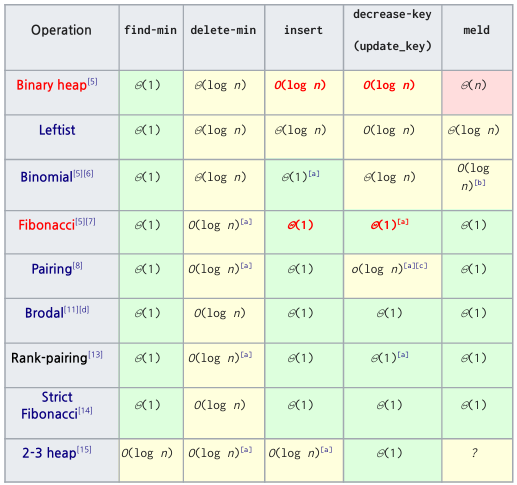

## 우선순위 큐(Priority Queue)
_________________________________________________
delete_max(또는 delete_min), find_max(또는 find_min), insert, update_key(optional)    
연산을 **O(logn)**시간에 이내에 제공하는 자료구조를 **우선순위 큐**라고 부른다.   
- 앞에서 설명한 힙(binary heap이라 불림)은 가장 일반적인 우선순위 큐이다.
- priority(우선순위)값에 따라 데이터를 관리할 필요가 있는 경우에 필수적인 자료구조   
- 그래프의 최소 신장 트리(Minimum Spaning Tree)를 구하는 Prim알고리즘이나 최단 경로를 구하는 Dijkstra 알고리즘 등에 사용   

**대표적인 우선 순위 큐**   
1. stack, queue, dequeue(삽입 시간을 일종의 priority로 간주)
2. heap, adative heap: max_heap, min-heap
3. 아래 표는 widipedia에서 정리한 여러 종류의 우선순위 큐
    - binary heap이 앞에서 설명한 heap이다.
    - Fibonachi heap도 관심을 가지면 좋다.

   
