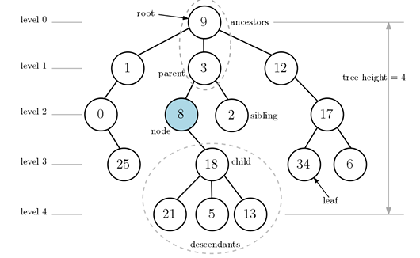
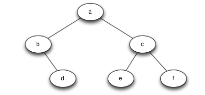
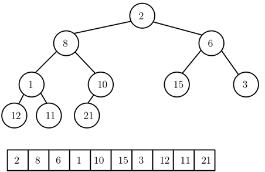
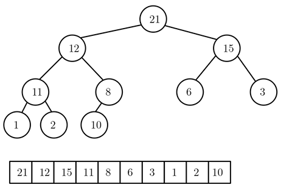
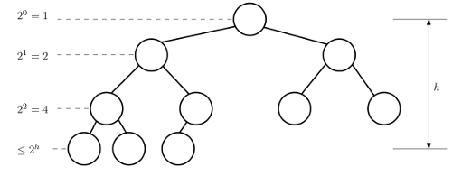
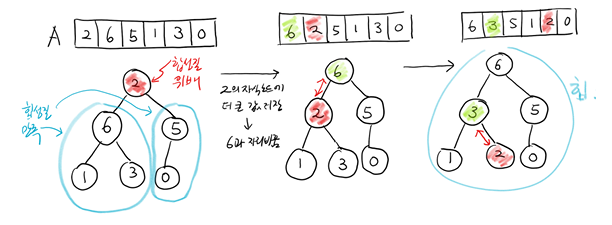
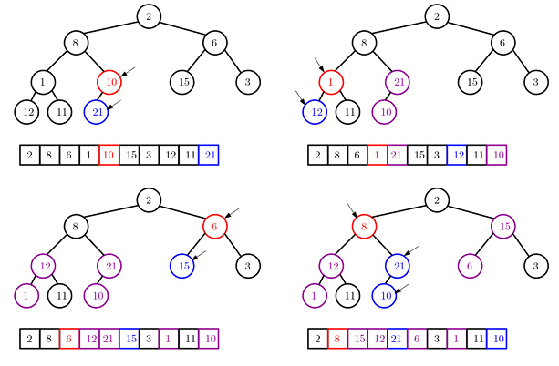
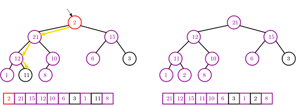

## Heap(힙)
______________________________________
- 연결리스트는 노드들이 한 줄로 연결된 선형적인 자료구조인 반면  
트리는 부모-자식 관계를 계층적으로 표현한 보다 일반적인 자료구조이다.

- 추상적으로 표현하면 연결 리스트처럼 데이터를 저장하고 있는 노드(node)와 노드를 연결하는 에지(edge 또는 link)로 구성된다.   
연결리스트와 차이점은 에지가 부모-자식 관계를 표현한다는 것.(어쩌면 연결리스트를 세로로 세우면 자식이 1개인 트리?)

### 기본 용어 정리

- 부모노드/자식노드 : 3은 8과 2의 부모 노드, 8과 2는 3의 자식 노드
- 조상노드/자손노드 : 9는 8의 조상노드, 8은 9의 자손노드
- 루트(root)노드  : 모든 노드의 조상 노드는 9
- 리프(leaf)노드 : 자식이 없는 노드
- 레벨(level) : 루트 노드의 레벨 0 을 시작으로 한 세대씩 내려가면서 1씩 증가
- 깊이(depth) : 루트에서 다른 노드를 연결하는 에지 개수(노드 5의 깊이 = 4)
- 경로(path) : 두 노드 사이를 연결하는 에지의 시퀀스
    1. 18과 12사이의 경로 : 18 → 8 → 3 → 9 → 12
     2. 경로의 길이는 에지의 수, 위 경로의 길이는 4
- 높이(height) : 노드의 높이는 자식 노드까지의 가장 큰 깊이
    - 노드 3의 높이는 3 (3에서 21, 5, 13이 가장 깊은 곳에 있으므로)
- 트리 높이(tree height) : 루트 노드의 높이가 트리 높이이며, 여기선 4
- 분지수(degree) : 노드의 분지수는 자신의 자식 수이며, 트리의 분지수는 가장 큰 분지수로 정의된다.   
  18의 분지수는 3, 6의 분지수는 0, 트리의 분지수는 3
- 부트리(subtree) : 어떤 노드와 그 노드의 자손들로 구성된 부분 트리

### Binary tree(이진 트리) 정의와 표현법
**이진트리** : 모든 노드의 자식이 2개를 넘지 않는 트리   
-> 실제 자료구조에서 사용되는 트리는 이진트리가 대부분임.

**힙** : 특별한 성질을 갖고 있는 이진트리 중 하나
-> 최대 값(또는 최소 값)을 빠르게 찾을 수 있는 이진트리 자료구조

**표현법 1** : 하나의 리스트만으로 표현 → 일반적인 힙의 표현 방법.   
[a, b, c, None, d, e, f]  # 레벨 0 부터 차례로, 왼쪽부터 오른쪽  
                          # b의 왼쪽 노드가 없으니 None으로 표시

**표현법 2** : 리스트를 중복해서 표현(재귀적인 방법)    
[a, [b, [], [d, [], []]], [c, [e, [], []], [f, [], []]] ]
1. [루트 a, a의 왼쪽 부트리, a의 오른쪽 부트리]형식으로 재귀적으로 정의
2. b 노드 입장에서는 [b, [], [d, [], []]]이 되며, d노드는 리프 노드이므로 [d, [], []]가 된다

**표현법 1의 장점과 단점**

**장점**

표현법 1로 표현된 트리 리스트A = [a, b, c, None, d, e, f]에서   
1. 루트 a는 A[0]에 저장되어 있고, 왼쪽 자식노드는 A[1], 오른쪽 자식노드는 A[2]에 저장되어 있다.   
2. 또 노드 c는 A[2]에 저장되어 있고, c의 왼쪽,오른쪽 자식노드는 각각 A[5], A[6]에 저장되어 있다.

-> **일반화**   
이 사실들을 일반화 시키면    
1. A[k]에 저장된 노드의 왼쪽 자식노드는 A[2*k + 1], 오른쪽 자식노드는 A[2*k + 2]이다.
2. A[k]의 부모노드는 A[(k-1) // 2]에 저장된다.

**단점**   
이 표현법의 문제점은 빈 칸이 많을 경우 메모리 낭비가 심하다는 것이다.   
이런 일이 발생하는 극단적인 트리 -> 오른쪽 자식 노드 하나만을 갖는 트리(오른쪽으로 극단적으로 기울어진 트리)

**단점 해결?(heap의 모양성질)**    
빈 칸을 만들지 않으면 메모리 낭비를 해결할 수 있다.    
-> 레벨마다 노드를 빼지 않고 가득 채우고,마지막 레벨엔 왼쪽부터 노드를 채워나간 트리모양   
다른 의미로 해석하면 리스트에 차례대로 저장된 값을 이진트리로 해석하면 레벨마다 가득 찬 모양이 된다는 의미이다.

**아래 그림은 메모리 낭비를 하지 않는 트리 구조이다.**   

### 힙(heap): 다음의 모양과 힙 성질을 만족하는 리스트에 저장된 값의 시퀀스
*모양성질* : 다음과 같은 모양의 이진트리여야 한다.  
1. 마지막 레벨을 제외한 각 레벨의 노드는 모두 채워져 있어야 한다.
2. 마지막 레벨에선 노드들이 왼쪽부터 채워져 있어야 한다.

*max-heap성질* : 루트 노드를 제외한 모든 노드에 저장된 (key)값은 자신의 부모 노드의 값보다 크면 안된다.

**아래 그림은 힙 성질을 만족하는 트리이다.**

**알아야 할 정보**
1. max-heap성질에 따라 루트 노드에는 가장 큰 값이 저장된다.
2. 실제 데이터 값은 리스트에 저장되어 있고, 리스트의 값이 표현하는 (가상의) 이진트리가 모양성질을 만족한다는 의미이다.
3. **힙의 높이 h**    

      
   n개의 값으로 구성된 힙의 높이 h는 얼마인지 생각해보자.
   1. 모양 성질에 따르면, 레벨 0부터 h-1에 있는 노드는 모두 채워져 있어야 한다.   
      따라서 노드 개수가 총 1 + 2 + 2** 2+ … + 2 ** h-1 = 2h- 1이다
   2. 레벨 h에는 하나 이상의 노드가 존재하므로 +1을 해서  2**h <= n이다.
   3. 양변에 로그2를 취하면 h <= logn이 성립한다. **따라서 h = O(logn)이다.**

#### heapify_down(k) 함수
리스트에 저장되어 있는 값을 이진트리로 해석하면 자동으로 모양 성질을 만족한다.    
그러나 힙 성질(max-heap)은 만족 못 할수 있다.   
따라서 힙 성질을 만족하지 못하는 리스트의 값들을 재배열해서 힙을 만들어야 한다.   
이 작업을 하는 함수를 **make_heap 함수**라 부른다. 이 함수를 위해 또 **heapify_down함수**가 필요하다.

A[k]를 제외하고 A[k]의 모든 자손 노드들이 모두 힙 성질을 만족한다고 가정할 때,   
A[k]의 값을(필요하다면) 아래로 내려가면서 힙 성질을 만족하는 위치로 이동시키는 함수

<pre>
<code>
def heapify_down(self,k,n):
    # n = 힙의 전체 노드 수 [heap_sort를 위해 필요]
    # A[k]를 힙 성질에 만족하는 위치로 내려가면서 재배치
    while 2*k+1 < n:        #리프 노드가 아니면 반복
        L, R = 2*k + 1, 2*k + 2     #L은 왼쪽 자식노드, R은 오른쪽 자식노드
        if self.A[L] > self.A[k] :       #세 노드의 최대값의 인덱스 찾기/ m은 max의미
            m = L
        else:
            m = k
        
        if R < n and self.A[R] > self.A[m] :        #여기서 R < n을 체크하는 이유는 오른쪽 자식노드가 없을 수 있기 때문 
            m = R                                   #그렇다면 L < n은 왜 안했을까? -> while조건문이 왼쪽 자식노드를 체크한거임
        # m = A[k], A[L], A[R]중 최대값의 인덱스

        if m != k:
            self.A[k], self.A[m] = self.A[m], self.A[k]
            k = m
        else: 
            break
</code>
</pre>

**heapify_down의 수행시간**
- 수행시간은 A[k]가 내려온 레벨 수에 비례한다.

- 가장 많이 내려오려면 루트인 A[0]가 힙의 높이(가장 깊은 곳인 리프)까지 내려오는 것이다.

- 한 레벨 내려올 때의 연산은 상수번의 비교를 하고 1번의 자리 바꿈을 하는 것이므로 O(1) 시간이면 충분하다.

- 따라서 최악의 경우에 힙의 높이에 비례하는 시간이 필요하다. 즉 O(log n)시간이 필요하다.

-> heapify_down : O(h) = O(log n)

#### make_heap : 현재 리스트들의 값들을 힙 성질을 만족하도록 재배열하는 함수
1. 리스트 A의 각 값에 대해 heapify_down을 호출해 재배치한다.
2. 마지막 레벨의 가장 오른쪽에 위치한 수 부터 루트 노드에 저장된 수까지 차례대로 호출하면 된다.
<pre>
<code>
def make_heap(self):
    n = len(self.A)
    for k in range(n-1, -1, -1):    #A[n-1] -> A[0] 순서로
        self.heapify_down(k,n)
</code>
</pre>
3. range(n-1, -1, -1) -> range(n//2, -1, -1)로 변경해도 문제없음 (이유는?)
    - 리프 노드는 자식 노드가 없기 때문에 heapify_down을 할 필요가 없다.
    - 힙에는 반이 리프 노드이고 나머지 반은 리프가 아닌 노드이다.   
      계산해보면, A[n//2 + 1], ...., A[n-1]은 모두 리프노드이다.
    - 따라서 A[n//2], ..., A[0]순서로 heapify_down을 하면 충분하다.
   
**아래 그림은 make_heap 과정**    

**make_heap의 수행시간**
- 분석 1: for 반복문은 n번 반복되고, 반복할 때마다 heapify_down이 한 번씩 호출된다.   
    -> heapify_down의 수행시간이 O(log n)이므로 O(nlog n)의 시간이 걸린다.

- 분석 2: 엄밀하게 분석하면 O(n)시간이면 된다. 추가 설명은 교재 108p 참고

#### heap_sort()
힙이 아니라면, 우선 make_heap으로 힙을 만든 후, heapify_down함수를 반복 적용하여 값들을 오름차순으로 재배치하는 함수   
-> 힙 정렬(heap sort) 알고리즘 이라 불림. (이후에 나오는 delete_max에서 pop을 안하고 노드의 수를 한 개 줄이는 것과 같음.)

- 가장 큰 값이 힙의 루트에 저장되어 있다. 이 값은 정렬 순서에 따라 리스트의 가장 마지막에 위치해야 한다.
    - A[0], A[n-1] = A[n-1], A[0] (두 값을 교환 swap)
    - 새로운  A[0]의 값은 힙 성질을 만족하지 않을 수 있으므로 heapify_down(n-1,0)을 호출해서 성질을 만족하는 자리로 이동
    - 이제 힙은 (n-1)개의 값 (A[0] ... A[n-2])으로 구성되므로 n = n-1로 변경 후 이 과정을 반복.

<pre>
<code>
def heap_sort(self):
    n = len(self.A)
    for k in range(len(self.A)-1, -1, -1):
        self.A[0], self.A[k] = self.A[k], self.A[0]
        n = n-1             #A[n-1]은 정렬 되었으므로
        self.heapify_down(0, n)
</code>
</pre>

**heap_sort()의 수행시간**     
make_heap 시간 = O(n)     
(swap + heapify_down)을 (n-1)번 반복하므로 **O(nlogn)**

#### 삽입연산 : insert(key) : 기존의 힙에 새로운 key 값을 삽입하는 연산
1. 힙 리스트 A의 가장 오른쪽에 새로운 값 x를 저장(append)하고, 이 값이 힙의 성질을 만족하도록 위치를 재조정해야 한다.
2. 이 경우엔 x가 힙의 리프 노드에 위치하므로, 루트 노드 방향으로 올라가면서 자신의 위치를 재조정하면 된다.   
-> 위치를 조정해 주는 heapify_up 함수를 구현.

<pre>
<code>
def heapify_up(self, k):        # 올라가면서 k를 재배치
    while k > 0 and self.A[(k-1)//2] < self.A[k] :
        self.A[k], self.A[(k-1)//2] = self.A[(k-1)//2], self.A[k]
        k = (k-1) // 2

def insert(self,key):
    self.A.append(key)
    self.heapify_up(len(self.A)-1)
</code>
</pre>

**insert()의 수행 시간**    
가장 마지막 레벨의 가장 오른쪽 빈 칸에 삽입되어 루트 노드까지 올라갈 수 있으므로   
heapify_up과 insert 모두 힙의 높이만큼 시간이 필요 -> O(logn)

#### 삭제연산 : delete_max() : 임의의 값을 삭제하는 것이 아닌 루트 노드에 저장된 가장 큰 값을 삭제 후 리턴하는 함수

-> 루트 노드의 값을 삭제 후 리턴해야 하므로, A[0]를 A[n-1]의 값으로 대체하고, heapify_down(0,n-1)를 호출해 A[0]를 재배치.

<pre>
<code>
def delete_max(self):
    if len(self.A) == 0 : return None
    key = self.A[0]
    self.A[0], self.A[len(self.A)-1] = self.A[len(self.A)-1], self.A[0]
    self.A.pop()            #실제로 리스트에서 delete
    heapify_down(0, len(self.A))    #len(A) = n-1
    return key
</code>
</pre>

**delete_max 수행시간**    
heapify_down이 1번 호출되고, 이 함수의 수행시간이 전체 시간을 결정하므로 O(log n)시간에 수행

### 연산 및 수행시간 정리 
-> n개의 값을 저장한 힙이라고 가정.

1. heapify_up : O(logn)
2. heapify_down : O(logn)
3. make_heap : n times * heapify_down = O(nlogn) -> O(n)
4. insert : 1 * heapify_up : O(logn)
5. delete_max : 1 * heapify_down : O(logn)
6. heap_sort : make_heap + n * delete_max = O(nlogn)

#### search 함수가 없는 이유?
heap에는 앞에 hash, 배열, 리스트, 연결리스트 등에 있던 search 함수가 없다.   
-> 그 이유는 힙이 정렬되어 있는 구조가 아니라 하나씩 다 비교해야함.    
   그러므로 힙은 search 함수를 효율적으로 하기위한 자료구조가 아니고 insert, find_max, delete-max에 특화된 자료구조.

#### 그렇다면 find-min, delete-min은 왜 없음?
-> 우리가 지금까지 만든 힙은 max-heap(루트에 가장 큰값)    
   min-heap(부모노드에는 자신과 값이 작거나 같은 값)을 정의하면 find-min, delete-min 사용가능

**heap.py에서 heap클래스 참고바람**
    

### 결론
Heap은 탐색보다는 ‘최대/최소 값 관리’에 특화된 자료구조. 따라서 특정 원소를 찾는 용도(탐색)로는 적합하지 않지만,    
우선순위가 중요한 문제(예: 우선순위 큐, 스케줄링, 최단경로, 정렬)에서는 다른 자료구조보다 단순하고 효율적인 해법을 제공.

#### 백준 예제 풀어보기
- 초급
1. 1927번 - 최소힙 :
2. 11279번 - 최대힙 :
- 중급
1. 11286번 - 절대값 힙 :
2. 2075번 - N번째 큰 수 :
- 심화
1. 13975번 - 파일 합치기 :
2. 1655번 - 가운데를 말해요 :
3. 1715번 - 카드정렬 :