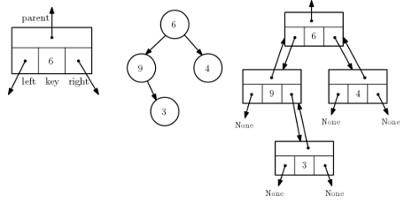
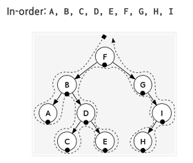
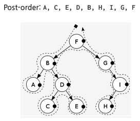

## Binary Tree (이진 트리)
__________________________________________
앞서 설명한 것과 같이 이진 트리는 자식 노드수가 2개를 넘지 않는 트리이다.(0개, 1개, 2개 가능)

*앞서 설명한 표현법 1*   
이진 트리를 배열 또는 리스트로 표현한 것. -> heap

*이번에 다뤄볼 표현법 3*   
-> 노드 클래스를 선언하여 모양대로 표현하는 가장 일반적인 방법
1. key 값 (+ 필요하면 추가로 정보를 저장할 수 있는 다른 멤버 선언 가능)
2. left, right, parent 노드를 가리키는 멤버(링크)

<pre>
<code>
class Node:
    def __init__(self, key = None, parent = None, left = None, right = None):
        self.key = key
        # 필요시 추가 self.value = value  -> 부가 정보
        # 필요시 추가 self.height = 0     -> 노드의 높이
        self.parent = parent
        self.left = left
        self.right = right
    
    def __str__(self):
        return str(self.key)
</code>
</pre>

   
위 그림의 가장 왼쪽은 Node 클래스의 멤버들을 도형으로 표현한 것이고,   
가운데 트리를 실제 Node를 이용해 연결한 것이 오른쪽 그림이다.    

**순회(travelsal)**   
-> 이진트리의 노드를 빠짐없이 방문하는 일정한 규칙   
예 1 : 트리의 노드의 key 값을 빠짐없이 출력하고 싶을 때   
예 2 : 노드의 key 값을 모두 일정한 값을 더하고 싶을 때  

**순회에는 일반적으로 3가지 방법이 존재**    
-> 항상 M을 기준으로 Pre, in , Post    
*Preorder* : MLR, M이 앞에 (pre) 온다 (Middle 노드 출력 -> Left subtree 순회 -> Right subtree 순회)   
*inorder* : LMR, M이 가운데 (in) 온다 (Left subtree 순회 -> Middle 노드 출력 -> Right subtree 순회)   
*Postorder* : LRM, M이 뒤에 (post) 온다 (Left subtree 순회 -> Right subtree 순회 -> Middle 노드 출력)
  
   
   

**순회 코드는 재귀 함수로 작성가능하다**

**preorder**
<pre>
<code>
def preorder(self) :    #노드 self와 자손을 preorder로 방문
    if self != None :
        print(self.key)                 # M
        if self.left : self.left.preorder()  # L
        if self.right : self.right.preorder() # R
</code>
</pre>

**inorder**
<pre>
<code>
def inorder(self) : 
    if self != None :
        if self.left : self.inorder()
        print(self.key)
        if self.right : self.inorder()
</code>
</pre>

**postorder**
<pre>
<code>
def postorder(self) :
    if self != None :
        if self.left : self.postorder()
        if self.right : self.postorder()
        print(self.key)
</code>
</pre>

