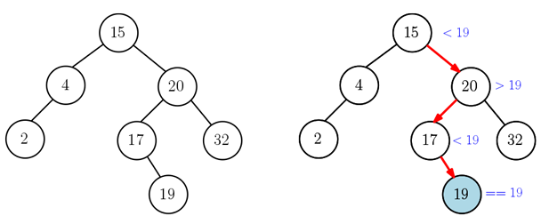
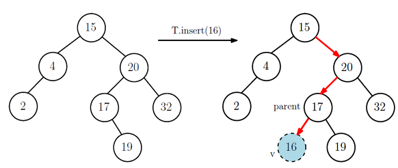
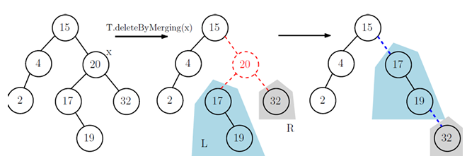
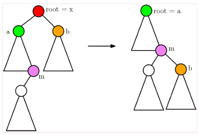
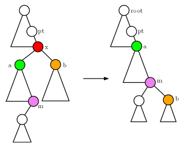
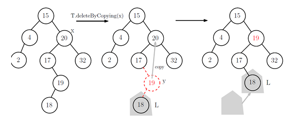

## Binary Search Tree (이진 탐색 트리)
___________________________________________
이진 트리중 가장 일반적으로 사용되는 트리

- 이진 탐색 트리는 아래 두 조건을 만족해야 한다.
1. None은 빈(empty) BST이다.
2. BST의 노드 v의 key 값(v.key)은 v의 왼쪽 자손 노드들의 key 값보다 작으면 안되고,   
   오른쪽 자손 노드들의 key 값보다 작아야 한다.

**BST 트리 예시**   

**BST 클래스**
<pre>
<code>
class BST :
   def __init__(self):
      self.root = None
      self.size = 0
      self.height = 0      #필요하다면 높이 저장

   def __len__(self):
      return self.size
   
   def __iter__(self):     #[고급] 무슨 뜻? 건너 뛰어도됨
      return self.root.__iter__()

   def __str__(self):      # [고급] 한방향리스트 __str__와 유사 정의
      return "- ".join(str(k) for k in self)

   def preorder(self, v) :    # preorder print from node v
         ...
   def inorder(self, v) :      # inorder print from node v
         ...
   def postorder(self, v) :   # postorder print from node v
         ...
</code>
</pre>

### 탐색 연산 : search
이진 탐색 트리 T의 노드 v와 v의 자손 노드들 중에서    
key값을 갖는 노드를 찾아 리턴하거나 없다면 None을 리턴함.

해시 테이블 연산처럼 find_loc(key)함수를 먼저 구현함   
-> key 값이 있다면 해당 노드 리턴, **없다면 그 값이 삽입될 곳의 부모 노드 리턴**

<pre>  
<code>
def find_loc(self, key):
   if self.size == 0:
      return None
   p = None          #v의 부모
   v = self.root
   while v :      # while v != None
      if v.key == key:
         return v
      elif v.key < key:
         p = v
         v = v.right
      else: 
         p = v
         v = v.left
   return p

def search(self, key):
   p = self.find_loc(key)
   if p and p.key == key:  # key is in tree
      return p
   else:                   # key is not in tre
      return None
</code>
</pre>

**연산 시간**
search는 find_loc과 거의 같다고 볼 수있다.
find_loc은 한 번의 비교로 한 레벨씩 내려가는 구조이다.   
따라서 h번 비교하면 찾을 수 있다.   
-> O(h)시간

### 삽입연산 : insert
key = 16을 삽입한다는 상황을 통해 설명하겠다.   

- 그림의 왼쪽 트리에 key = 16을 삽입하고 싶다면, 먼저 삽입될 위치를 *find_loc* 함수를 이용해 찾는다.   
   ->find_loc함수에 의해 16의 부모노드가 될 17 노드를 리턴함.(값의 크기에 의해 17의 왼쪽에 삽입 되어야한다.)   
- 17노드의 어느 쪽 자식노드로 연결되는지는 key 값을 서로 비교해보면 쉽게 알 수 있으므로,   
    왼쪽 자식노드에  16을 연결한다. (주의)새로 삽입한 노드를 마지막에 반환함.

<pre>
<code>
def insert(self, key):     # value값도 추가로 받을 수 있음.
      p = self.find_loc(key)
      
      if p == None or p.key != key :      #tree안에 key값이 없어야 insert하니깐 체크
         v = Node(key)
         if p == None:                    #tree가 빈 tree라면
            self.root = v
         
         else: 
            v.parent = p
            
            if p.key >= key :          #왼쪽에 넣을지 오른쪽에 넣을지 체크
               p.left = v
            else:
               p.right = v
         
         self.size += 1
   
         #이 곳에 height 정보 update하는 코드 또는 함수 삽입
         #update_height 함수를 준비해 호출하는 식으로(밑의 코드)
         return v
      else:
         print("key is alread in tree")
         return p    #중복 key를 허용하지 않으면 None 리턴

def update_node_height(self, v):    #노드 v의 높이 수정
      if v:
         l = v.left.height if v.left else -1
         r = v.right.height if v.right else -1
         v.height = max(l, r) + 1

def update_height(self, v):      # v에서 root까지 올라가면서 높이 수정
      while v != None:
            self.update_node_height(v)
            v = v.parent
</code>
</pre>

**연산 시간**
insert의 연산 시간은 find_loc을 제외하면 간단 비교 연산 뿐이다.   
따라서 find_loc의 연산시간과 같다.   
-> O(h)

### 삭제연산 : delete
삭제연산에는 두 가지 방법이 있다 -> Merging과 Copying 방법   

**deleteByMerging**
1. 노드 x를 제거할 노드라고 한다면, x의 왼쪽 서브트리는 L, 오른쪽 서브트리는 R이라고 한다.
2. x를 제거 한 후 L을 x의 위치로 이동.(x의 부모노드의 입장에서 L이 x대신 자식노드가 됨.)
3. R을 L에 있는 가장 큰 노드 m의 오른쪽 자식 노드가 되도록 한다.  

   

**merging을 할 때 삭제할 노드 x가 root인 경우와 아닌 경우를 고려해야함**  
a = x.left,  b = x.right 로 지정.

1. root == x 인 경우 (즉, 삭제할 노드가 루트 노드인 경우 - 트리의 루트 노드가 바뀜)
    - a != None 이라면, (즉 m이 존재한다면), b가 m의 오른쪽 자식 노드가 되도록 링크 수정한 후, self.root = a로 변경
    - a == None 이면, b를 새로운 루트로 변경하기만 하면 됨.    
   

2. root != x 인 경우
    - pt는 x의 부모노드를 의미한다.
    - a != None 이면, m이 존재하므로 b를 m의 오른쪽 자식노드로 만든 후, a가 pt의 자식노드가 되도록 함.
    - a == None 이면, b가 pt의 자식노드가 되도록 함.    

**Pseudo 코드**
<pre>
<code>
def deleteByMerging(self, x):
      # assume that x is not None
      a, b, pt = x.left, x.right, x.parent
      # c = node which will be at the position x
      # s = 균형이 깨질 가능성이 있는 첫 번째 노드를 리턴함!   
            (균형이진탐색트리의 delete연산에 이용될 예정)
      
      if a == None :
         c = b
         s = pt
      else: # a != None
         c = m = a
         while m.right:       # find m
            m = m.right
         
         # make b as the right child of m
         m.right = b
         if b:
            b.parent = m
         s = m

      #여기까지는 a가 비었을때 아닐 때 
      # 밑에는 지우는 노드가 루트일 때 아닐 때

      if self.root == x : # c becomes a new root
         if c:
            c.parent = None
         self.root = c
         
      else :            # c becomes a child of pt (of x)
         if pt.left == x:        #이걸 체크하는 이유? 삭제할 노드 x가 왼쪽 자식인지 오른쪽 자식인지 확인
            pt.left = c
         else:
            pt.right = c
         if c:
            c.parent = pt
      self.size -= 1
      
      self.update_height(s)   # s부터 root까지 높이 수정
      
      return s                # first node that would be rebalanced

            
</code>
</pre>

### deleteByCopying
노드 x를 제거한다고 하면, x의 왼쪽 서브트리 L과 오른쪽 서브트리 R을 다음과 같이 조정한다.
1. L에서 가장 큰 값을 갖는 노드 y를 찾는다.
2. y의 key값을 x의 key값으로 카피한다.
3. y의 왼쪽 서브트리가 존재한다면 y의 위치로 올린다.

### 연산 수행시간
1. search : 최악의 경우에 가장 깊은 곳의 노드까지 비교하면서 내려가야 하므로  
   트리의 높이에 비례하는 시간이 필요하다. 즉 트리의 높이를 h라고 하면, O(h)시간이 걸린다.
2. insert : insert 또한 search 과정을 통해 새로운 노드가 삽입될 위치를 찾은 후,   
   몇 개 노드의 parent, left, right를 수정하는 것이므로 O(h) 시간이 걸린다.
3. delete : delete 또한 m을 찾기 위해 최악의 경우에 h 만큼 비교하면서 내려가기 때문에 O(h) 시간이 걸린다.

**결론**
위 세개의 연산이 모두 O(h)의 시간이 걸리기 때문에 h의 크기를 줄여보자  
-> 균형 이진 탐색트리를 공부 해보자!