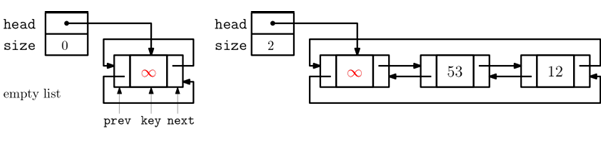
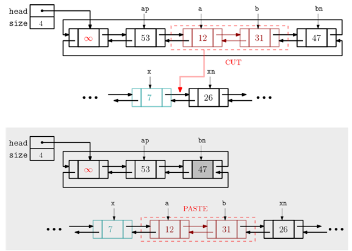

## 양방향 연결리스트(Doubly Linked List)
___________________________________________________
- 한방향 연결 리스트의 **결정적인 단점**은 다음 노드에 대한 링크(next)만 있어,이전 노드를
알기 위해선 head 노드부터 차례로 탐색을 해야 한다는 것이다.  
-> 한방향 연결리스트에서는 tail 노드를 지우기 위해 O(n)시간 필요

#### 한방향 연결리스트의 단점을 보완하는 다음과 같은 양방향 연결 리스트를 설계해보자.
1. 이전 노드로의 링크(prev)를 가지고 있어 왼쪽으로도 이동 가능하도록 한다.
2. 마지막 노드와 첫 노드가 서로 연결된 원형(circular) 리스트를 가정한다.
3. 첫 노드, 즉 **head 노드는 항상 dummy 노드** 가 되도록 한다.  
-> **dummy 노드**는 일종의 리스트의 처음을 구분할 수 있는 "marker"의 기능을 하는 특별한 노드이다.
따라서 빈 리스트는 위의 그림처럼 dummy노드 하나로만 구성된다.

**아래는 노드 클래스**
<pre>
<code>
class Node:
    def __init__(self, key = None):
        self.key = key                  #노드에 저장되는 key 값
        self.next = self.prev = self    #자기로 향하는 값
    
    def __str__(self):                  #print(node)인경우 출력할 문자열
        return str(self.key)
</code>
</pre>

**아래는 양방향(원형) 연결 리스트 클래스**
<pre>
<code>
class DoublyLinkedList:
    def __init__(self):
        self.head = Node()
        self.size = 0
    
    def __iter__():
         ----
    def __str__():
        ----
    def __len__():
        _____
</code>
</pre>

#### [중요] splice(a,b,x):다른 연산에 이용되는 매우 중요한 기본 연산
- 노드 a부터 노드 b까지를 떼어내(cut) 노드 x 뒤에 붙여(paste)넣는 연산(cut-and-paste 연산이라고 기억해보자)
    1. 조건: a와 b가 동일하거나 a다음에 b가 와야함.
    2. 조건: head 노드와 x는 a와 b사이에 포함되면 안됨.
- [주의1] 노드 x가 a와 b의 노드일 수도 다른 리스트의 노드일 수도 있다.
- [주의2] DoublyLinkedList 클래스에 노드 개수를 관리하는 size 멤버 변수가 있다면,splice 이후의 노드 개수의 변화를 
적절히 반영해야 한다.

**아래는 splice 코드**
<pre>
<code>
def splice(self,a,b,x):
  if a == None or b == None or x == None:
      return
  ap = a.prev           #ap is the previous node of a
  bn = b.next           #bn is the next node of b
  xn = x.next           
  
  #CUT [a..b]
  ap.next = bn
  bn.prev = ap
  
  #PASTE [a..b] after x
  x.next = a
  b.next = xn
  a.prev = x
  xn.prev = b
</code>
</pre>

#### 탐색 및 기본연산

1. search(key): key 값 갖는 노드를 리턴하고, 없으면 None리턴 
<pre>
<code>
def search(self,key):
  v = self.head.next    #dummy node
  while v != self.head:
    if v.key == key
      return v
    v = v.next
  return None
</code>
</pre>

2. isEmpty() : 빈 리스트면 True 아니면 False리턴
3. first(), last():처음과 마지막 노드를 리턴, 빈 리스트면 None리턴

**이동과 삽입**연산:매개변수 self는 생략함(splice 함수를 호출하여 가능)
1. moveAfter(a,x):노드 a를 노드 노드 x뒤로 이동  
-> splice(a,a,x)와 같음
2. moveBefore(a,x):노드 a를 노드 x앞으로 이동  
-> splice(a,a,x.prev)와 같음
3. insertAfter(x,key):노드 x 뒤에 데이터가 key인 새 노드를 생성해 삽입   
-> moveAfter(Node(key),x)와 같음
4. insertBefore(x,key): 노드 x앞에 데이터가 key인 새 노드를 생성해 삽입   
-> moveBefore(Node(key),x)와 같음
5. pushFront(key): 데이터가 key인 새 노드를 생성해 head 다음(front)에 삽입  
-> insertAfter(self.head,key)와 같음
6. pushBack(key): 데이터가 key인 새 노드를 생성해 head 이전(back)에 삽입  
-> insertBefore(self.head,key)와 같음.   

**삭제 연산**(매개변수 self는 생략했음)   

1. remove(x) 또는 deleteNode(x) : 노드 x를 제거
<pre>
<code>
def remove(self,x):
  if x == None or x == self.head:
    return
  x.prev.next, x.next.prev = x.next, x.prev  # x를 떼어냄
</code>
</pre>

2. popFront(): head 다음에 있는 노드의 데이터 값 리턴, 빈 리스트면 None리턴
<pre>
<code>
def popFront(self):
  if self.isEmpty():
      return None
  key = self.head.next.key
  self.remove(self.head.next)
  return key
</code>
</pre>

3. popBack(): head 이전에 있는 노드의 데이터 값 리턴, 빈 리스트면 None리턴

**기타 연산:join, split**
1. join(another_list):self뒤에 anoter_list를 연결.
2. split(x):self를 노드 x 이전과 x 이후의 노드들로 구성된 두 개의 리스트로 분할

#### 위의 연산 코드에 size(노드 개수를 저장하는 멤버 변수)에 대한 업데이트 부분은 생략되어 있으며
#### Doubly_Linked_List.py에서 위 연산들 참고바람.

### 연산의 시간 복잡도
-> 연산의 최악의 경우의 시간복잡도(n개의 값이 저장되어 있다고 가정)

1. moveAfter/Before: O(1)
2. insertAfter/Before: O(1)
3. pushFront/Back: O(1)
4. popFront/Back: O(1)
5. remove: O(1)
6. search: O(n)

### 결론
-장점 : 연산의 대상이 되는 노드가 결정된 후에는 대부분의 연산이 O(1)시간에 수행된다.
(특정 값을 찾는 탐색 연산은 당연히 모든 노드를 검사할 수 있으므로 O(n)시간이 필요)   
-단점 : 두 링크(prev,next)를 관리해야 하는 부담과 배열보다 많은 메모리 사용

#### 백준 풀어보기
- 초급 - 양방향 구조 익히기
1. 10866 -
2. 28279 -
3. 2346 -
4. 1021 -

- 중급 - 삽입 삭제 응용
1. 1406
2. 5397
3. 3190

- 도전과제
1. 20055
2. 22856
3. 22862