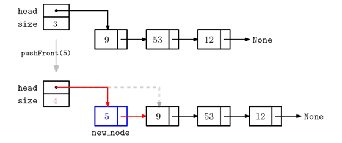
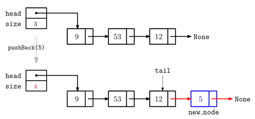
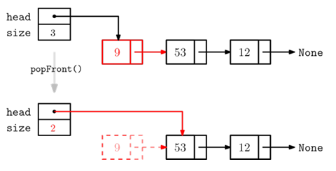
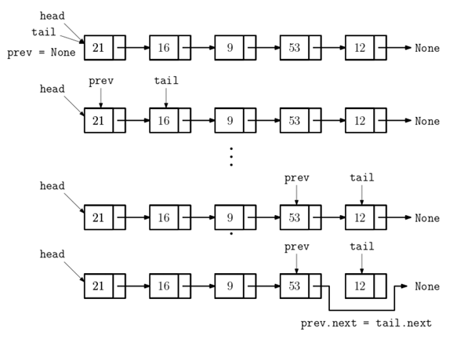

## 한 뱡향 연결 리스트 (Singly_Linked_List)
__________________________________________________
### 연결리스트 ###
- 기본적으로 연결 리스트를 사용하기 위해서는 노드가 필요하다
- 노드는 key값과 link는 필수적이고 그 외에 value값들도 가질 수 있다.

**아래는 노드 클래스이다.**

<pre>
<code>
class Node:
    def __init__(self,key = None, value = None):
        self.key = key          #노드를 다른 노드와 구분하는 키값
        self.value = value      #필요한 경우 추가 데이터 value
        self.next = None        #다음 노드로의 링크(초기값은 None)
    
    def __str__(self):          #print(node)인 경우 출력할 문자열
        return str(self.key)    #str((self.key,self,value))
</code>
</pre>

- 연결 리스트는 노드(node)가 링크(link)에 의해 기차처럼 연결된 순차(sequential)
자료구조로 링크를 따라 원하는 노드의 데이터에 접근하고 수정한다.
- 배열은 크기가 미리 정해지고 배열에 저장된 값을 반복적으로 참조(read/write)하는 경우에
적합한 순차적 자료이며 연결리스트는 크기가 정해지지 않고 삽입과 삭제가 자주 반복되는 경우에 적합한
자료구조

### 한방향 연결 리스트 ###
- 노드들이 한 쪽 방향으로만(next 링크를 따라) 연결된 리스트
- 가장 앞쪽에 있는 노드를 특별히 head 노드라 부르고, head 노드를 통해 리스트의 노드를 접근한다.
-> head 노드부터 시작해 링크를 계속 따라가면 모든 노드를 접근 할 수 있으므로,head노드가 연결 리스트를
대표한다고 말할 수 있음
- 가장 뒤에 있는 노드는 다음 노드가 없기 때문에 그 노드의 head링크는 None을 저장함. 즉 next 링크가 None이면 그 노드가 마지막 노드.

**아래는 한 방향 연결리스트 클래스**
<pre>
<code>
class SinglyLinkedList:
    def __init__(self):
        self.head = None   #연결리스트 가장 앞의 노드(head), 초가값은 None
        self.size = 0      #리스트의 노드 개수
    def __iter__(self):    #generator 정의 / 연결 리스트의 노드를 for문 형식으로 접근 위해
        v = self.head
        while v != None:
            yield v
            v = v.next
    
    def  __str__(self):     #연결리스트의 값을 print 출력
        return "->".join(str(v) for v in self)
        #generator를 이용해 for문으로 노드 순서대로 접근해서 join 함 -key 값 사이에 -> 넣어 출력
    
    def __len__(self):
        reutrn self.size    #len(A) = A의 노드 개수 리턴

</code>
</pre>

### __iter__ -> 제너레이터 추가 설명 ###
-리스트에서는 for + in + 리스트 구조로 리스트 내의 원소들을 출력가능.
<pre>
<code>
A = [3,5,-1,9]
for x in A:
    print(x)
</code>
</pre>
-그러나 연결 리스트로는 이 구조 불가 -> 제너레이터(iterator라는 이름의 특별한 메서드가 클래스 내에 있을 시 for in 을 사용가능)

### 그외 지원 연산 ###
- 삽입,삭제, 탐색 등의 연결 리스트를 수정할 수 있는 연산 제공
L = SinglyLinkedList()
1. L.pushFront(key):key 값을 갖는 새 노드를 L의 가장 앞에 삽입  
   -> L.head변경
2. L.pushBack(key):key 값을 갖는 새 노드를 L의 가장 뒤에 삽입
3. L.popFront():L의 첫 노드(head 노드)를 삭제한 후 key 값을 리턴
4. L.popBack():L의 마지막 노드를 삭제한 후 key 값을 리턴
5. L.search(key):L에서 key 값을 갖는 노드를 찾아 리턴
6. L.remove(v): L에서 노드 v를 제거(L.delete(key)형식으로 key값을 갖는 노드를 찾아 제거하는 함수 설계도 가능)

### 삽입 연산: pushFront, pushBack ###

**pushFront**

- pushFront는 현재 head 노드 앞에 새로운 노드를 생성해 삽입한다.
- 삽입된 노드가 새로운 head 노드가 되어야 함.

**pushFront 코드**
<pre>
<code>
def pushFront(self,key,value=None):
   new_node = Node(key,value)       #새 노드 생성
   new_node.next = self.head        #head노드 앞에 삽입
   self.head = new_node             #새로운 head노드 지정
   self.size += 1                   #노드 개수 증가
</code>
</pre>

**pushBack**

- pushBack은 그림에서 보듯 마지막 노드(tail) 다음에 삽입이 되므로 tail 노드의 next링크가 새로운 노드로 변경 되어야 한다.
- 만약 tail 노드가 None인 경우, 즉 빈 리스트라면 새로운 노드가 리스트의 head 노드가 된다.

**pushBack 코드**

<pre>
<code>
def pushBack(self,key,value = None):
   new_node = Node(key,value)
   if self.size == 0:
      self.head = new_node
   else:
      tail = self.head
      while tail.next != None:
         tail = tail.next
      tail.next = new_node
   self.size += 1

</code>
</pre>

### 삭제연산: popFront, popBack
**popFront**

-popFront는 리스트의 헤드를 삭제하고 head노드의 key 값을 반환하는 함수로 두가지로 나뉜다.
1. 빈리스트라 지울 head가 없는 경우
2. 최소 하나 이상의 노드가 있는 경우

<pre>
<code>
def popFront(self):
   if self.size == 0:         #(1)의 경우
      return None
   else:                      #(2)의 경우
      x = self.head
      key = x.key
      self.head = x.next
      del x                   #delete x from memory
      self.size -= 1
   return key
</code>
</pre>

**popBack**

--popBack은 tail노드를 찾아 지우고 key값을 반환하는데,tail 노드의 전 노드의 링크를 수정해야 하므로  
그 노드를 알아야 한다.(tail노드의 전 노드를 prev노드라 부르기로 하자.)

- 위그림은 prev노드와 tail노드, 즉 서로 인접한 두 노드를 prev = None, tail = head로  시작하여 tail노드가 가장 마지막 노드에 도달할 때까지 움직인다. 그 때 prev 노드가 tail 직전 노드가 된다.

<pre>
<code>
prev, tail = None, self.head
while tail.next != None:
   prev = tail
   tail = tail.next
</code>
</pre>

- popBack의 경우는 세가지로 나눠서 작성해야한다.
1. 빈리스트인 경우.
2. 리스트에 노드가 하나만 있는 경우
3. 리스트에 두 개 이상의 노드가 있는 경우를 각각 처리해야 한다.

<pre>
<code>
def popBack(self):                  #(1)의 경우
   if self.size == 0:
      return None
   
   else:
      prev, tail = None, self.head
      while tail.next != None:
         prev = tail
         tail = tail.next
      if prev == None:              #(2)의 경우
         self.head = None
      else:                         #(3)의 경우
         prev.next = tail.next
      key = tail.key
      del tail
      self.size -= 1
      return key
</code>
</pre>

### 탐색연산 search(key)
-> key 값을 저장한 노드를 찾아 리턴하고 없으면 None 리턴

방법 1: head 노드부터 next 링크를 따라가며 뒤지는 방법
<pre>
<code>
def search(self,key):
   v = self.head
   while v != None:
      if v.key == key:
         return v
      v = v.next
   return None
</code>
</pre>

방법 2: for 루프를 이용하는 방법 <-__iter__(self)에 의해 가능
<pre>
<code>
def search(self,key):
   for v in self:
      if v.key == key:
         return v
   return None
</code>
</pre>

**삭제연산 remove()**
- remove(v) - 노드 v를 리스트에서 제거하는 함수.
- 작성시에 세가지를 고려해야한다.
   1. 리스트가 비어 있거나 노드 v가 None인 경우 -> do nothing
   2. 노드 v가 head노드인 경우 -> popFront 호출하여 처리
   3. 노드 v의 전 노드 w를 찾은 후(popBack의 경우처럼) w.next = v.next로 w의 링크를 수정.
<pre>
<code>
def remove(self,v):
   if self.size == 0 or v == None:
      return 
   elif v== self.head :
      self.popFront()
   else:
      w = self.head
      while w.next != v:
         w = w.next
      w.next = v.next
      self.size -= 1
</code>
</pre>

#### *정리하여 singly_linked_list.py에 모든 연산을 넣어놨음.*

### 연산의 시간복잡도
-> 대상이 되는 노드가 head 노드로부터 k번째 떨어진 노드라 가정

1. pushFront - O(1)
2. pushBack - O(k)
3. popFront - O(1)
4. popBack - O(k)
5. search - O(k)
6. remove - O(k)

### 결론
- 장점
   1. 어떤 노드 x의 다음에 새로운 노드를 삽입하는 연산은 O(1)시간이면 가능 
  ->단, 노드 x를 알고 있어야 한다.
  2. 배열의 경우 삽입할 빈 칸을 만들기 위해, 그 이후의 값들을 한 칸씩 이동해야한다.  
  따라서 최악의 경우 O(n)이지만 한방향 연결리스트는 O(1)
- 단점
1. k번째 값을 배열에서는 O(1)시간에 알 수 있지만,연결리스트에선 O(k) 시간이 필요하다.
2. 바로 전 노드(prev 노드)로의 링크가 없어 삽입과 삭제의 시간이 많이 걸린다.(ex. popBack 연산)

#### 백준 문제 풀어보기
- 초급 - 연결 리스트 구조 익히기
1. 1406 -
2. 5397 -
3. 1158 -
4. 14719 -
5. 2346 -

- 중급 - 삽입/삭제/탐색 응용
1. 11570 -
2. 16987 -
3. 20055 -
- 도전 과제 - 응용
1. 17471 -
2. 2468 -
3. 20529 -
